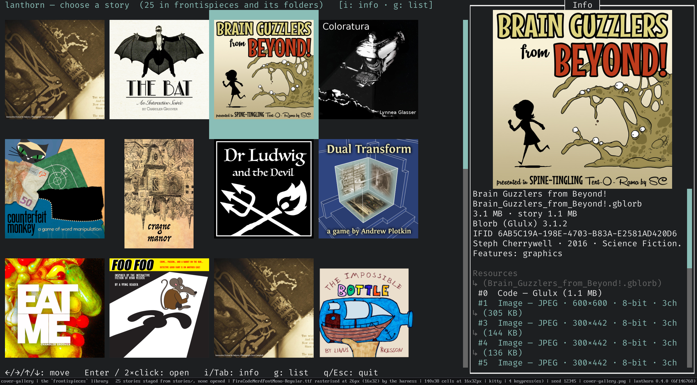
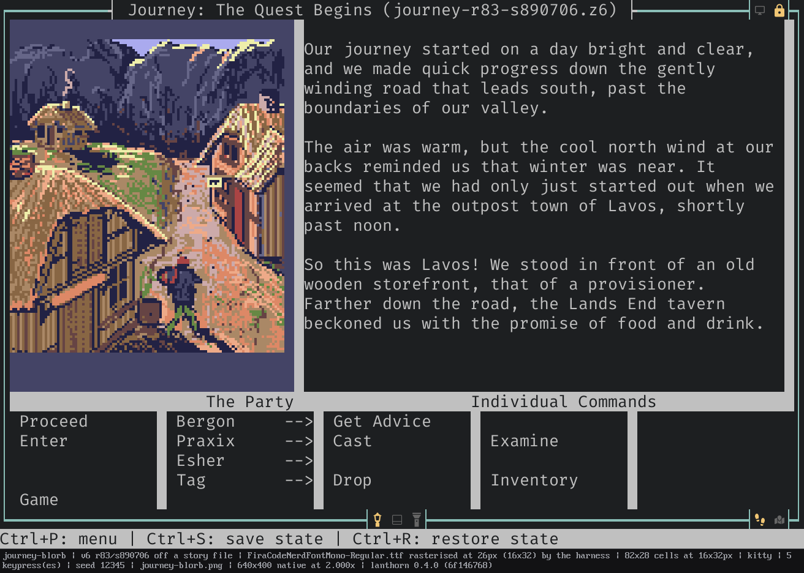
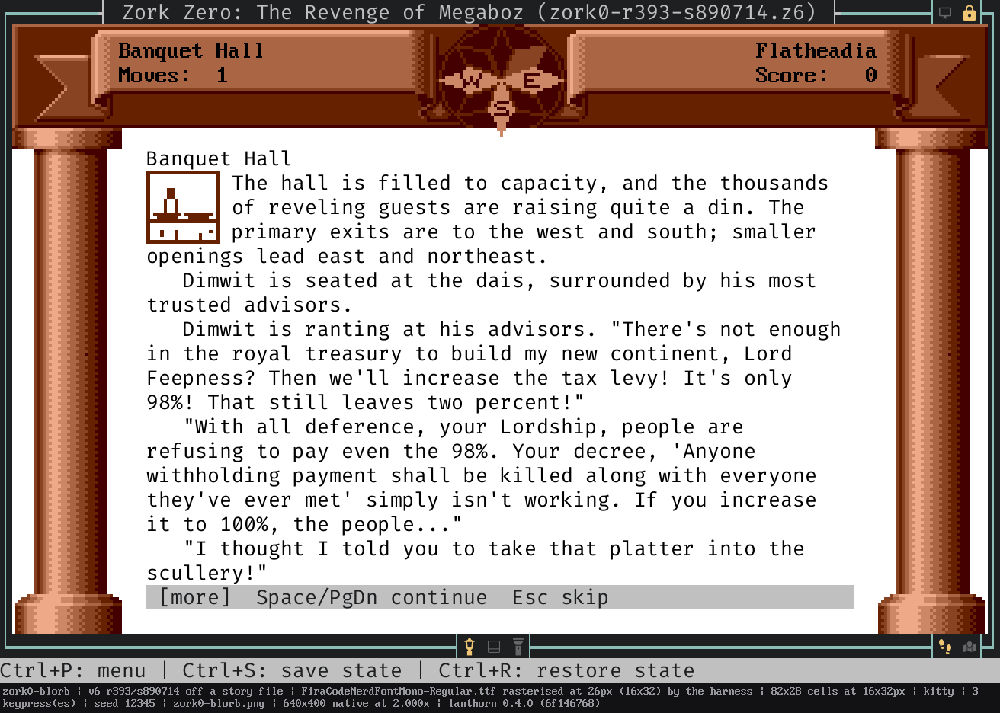
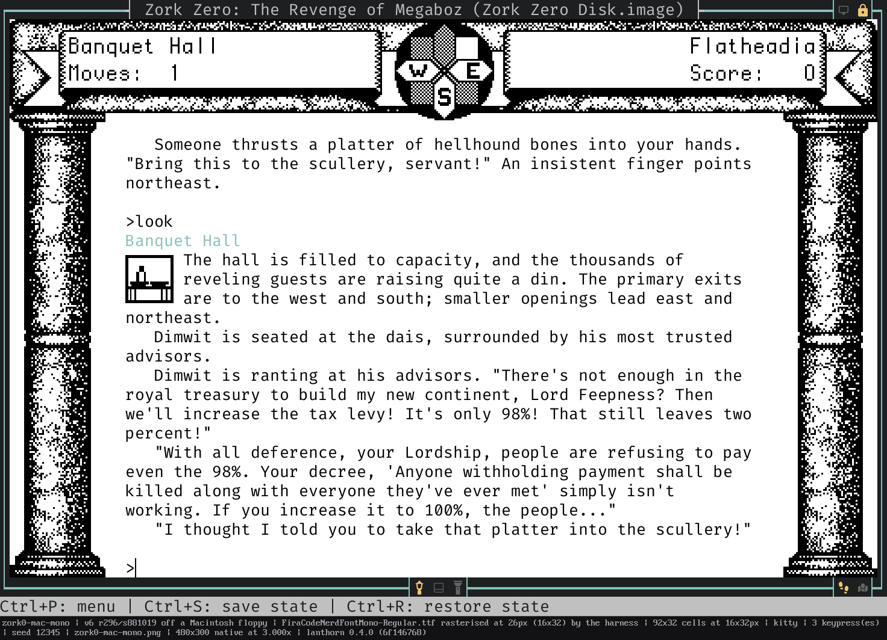
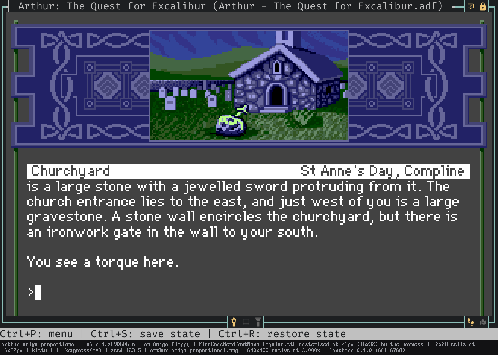
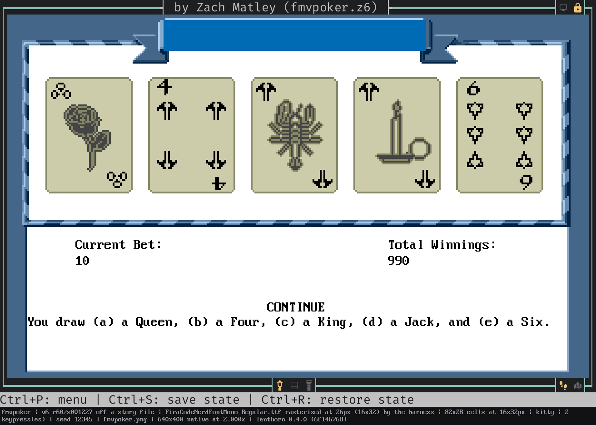
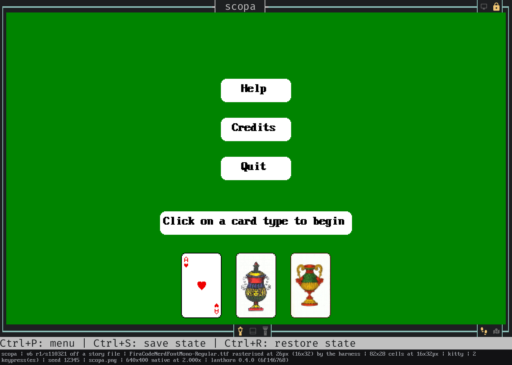
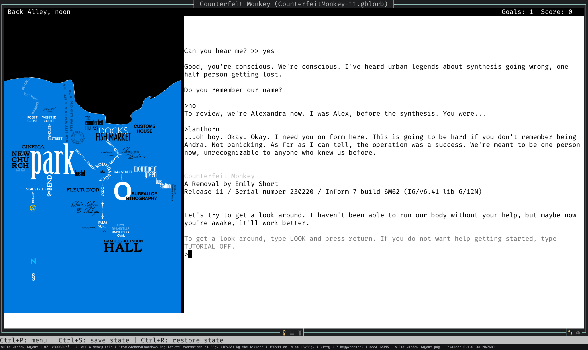
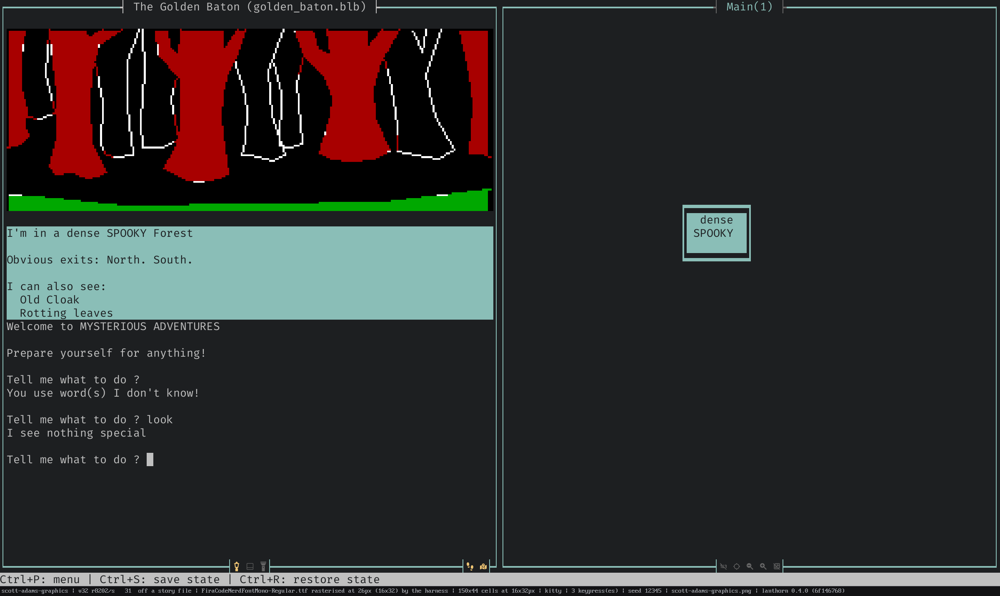
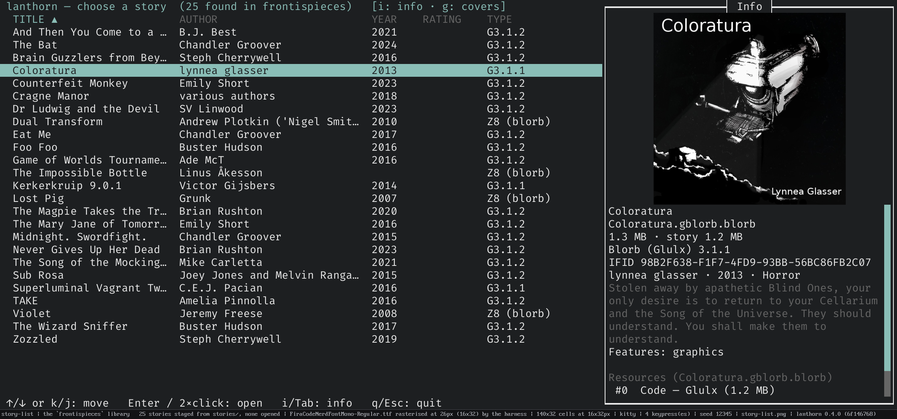

<p align="center">
  
</p>

[](https://github.com/sharkusk/lanthorn/actions/workflows/test.yml)
[](https://github.com/sharkusk/side-quest)

**Play interactive fiction in your terminal while lanthorn draws the map for you — live, as you explore.**

### Supported story formats:

* **Z-machine v3–v8** (incl. graphical v6)
* **Glulx**
* **Scott Adams**

### Supported original Infocom disk formats:

* Amiga
* Mac
* PC
* ST
* AppleII
* C-64/128

---

## See it

**The map draws itself while you play.** A lap of the white house in each
direction — nothing typed but the game's own commands, no annotation, no graph
paper.


**Your library at a glance.** The story picker shows it as a list or as a grid of covers. Press `[TAB]` to
bring up the story info panel.



<details>
<summary>More screenshots</summary>

<!-- SCREENSHOTS: additional stills / GIFs can be dropped in below -->






















</details>

---

## Quick start

Grab the archive for your platform from the
[**latest release**](https://github.com/sharkusk/lanthorn/releases) — Linux
(x86_64), macOS (universal), and Windows (x86_64) builds ship with every
release, four binaries in each: `lanthorn` itself plus the no-map CLI players
(`zvm-cli` / `gvm-cli` / `scott-cli`). Extract it and run:

```bash
lanthorn ~/if-games/        # a directory — opens the story picker. The usual way in.
lanthorn zork1.z3           # or straight into one game
```

lanthorn offers to remember the first directory you open, so a bare **`lanthorn`**
goes there next time. It opens disk images too — see
[**Play the original disks**](#play-the-original-disks). `lanthorn --help` has the
flags; the ones people reach for are `--sound off` *(next release; today
`--no-sound`)*, `--images off` *(next release; today `--no-images`)* and
`--image-protocol`.

*Next release:* a URL is a launching shape too, alongside a directory and a disk
image:

```bash
lanthorn https://ifarchive.org/if-archive/games/zcode/curses.z5
```

A web address works anywhere a path does. lanthorn fetches it, opens it like any
other file — story, Blorb, disk image, zip — and then offers to keep it in your
library so the next launch finds it without fetching again.

---

## Try these first

A few things worth doing in your first ten minutes. Everything else can wait.

**In the story picker**

| | |
|---|---|
| **r** | Fetches titles, blurbs, ratings and cover art from IFDB for everything missing them. Do this first — until you do, there is not much for the grid to show. |
| **g** | Flips the list view into a grid of covers. |
| **/** | Searches IFDB by title or author and downloads straight into your library. |
| **Shift+U** | *Next release:* downloads a story straight into your library from a web address you paste. |
| **Ctrl+F** | *Next release:* filters your library as you type: title, author, filename or folder. |
| **Enter** on a folder | *Next release:* a library sorted into folders is listed folder by folder; Enter opens one and **Backspace** returns up. |
| **Tab** | Shows the info panel for the highlighted story. |
| **o** | Launch options for this story — renderer, machine, artwork. |

**In the story**

| | |
|---|---|
| **Tab** | Completes from the words *this story* actually knows — no more guessing whether it wants `lamp` or `lantern`. |
| **/** on an empty line | A fuzzy palette over every command. The fastest way to find out what there is. |
| **Ctrl+S** or **Ctrl+R** | Saves and restores the map, the screen and your scrollback — not just the game's own state. |
| **/open-settings** | The settings worth changing, each with a line saying what it does. |
| **Ctrl+P** | The quick command palette. |

And the thing that needs no keys at all: **explore, and watch the map draw
itself.**

---

## What it does

- **Three engines, one player** — Z-machine v3–v8 (including graphical v6),
  Glulx, and Scott Adams, auto-detected from the file. Clean-room, pure Rust, no
  C bindings. → [interpreter](docs/internals/interpreter.md)
- **A map that draws itself** — rooms placed, routed and de-overlapped as you
  explore, across switchable layers. Click a room and it shows you the way there.
  *Next release:* switch on the return probe and it will go and **find
  the way back** for you, in a silent throwaway copy of your game — closing the
  one-way gaps an automap is otherwise full of, and never once assuming that a
  passage runs both ways.
  → [mapping](docs/internals/mapping.md)
- **The original disks, as the original machines** — hand it an Amiga, Macintosh,
  Apple II, Atari ST, PC or Commodore floppy and it plays the build on that disk,
  with that machine's artwork, sound, palette and status line. Nine machines,
  measured off emulator captures rather than guessed.
  → [Play the original disks](#play-the-original-disks)
- **Graphical v6, drawn properly** — *Zork Zero*'s illustrated frame at an
  authentic 640×400, set in the typeface the original interpreter used, read off
  the media rather than bundled. *Next release:* three ways to draw it:
  **hybrid** puts text in real terminal cells and art in real pixels,
  **raster** paints the whole pane as one image in the game's own face, and
  **extended** keeps raster's face while growing the story downward instead of
  letterboxing it — a tall terminal gets more rows to read, with the side art
  tiled out of its own artwork at the artist's spacing. `/set-v6-render` cycles
  them. → [v6 graphics](docs/internals/v6-graphics.md)
- **Saves that remember the whole session** — map, screen and scrollback, not
  just the game's own state, whether you press Ctrl+S or the story does its own
  `SAVE`. Plus Quetzal import/export and per-turn rewind.
  → [saves](docs/internals/saves.md)
- **A real terminal UI** — mouse, resizable panes, a story picker with IFDB
  search, command palette, in-game InvisiClues, transcript search, a debug
  disassembler, and a theme every part of which you can restyle.
  *Next release:* click the `◈` on the story pane's border and every
  word already on screen that this story's parser would accept **lights up** for
  a moment — the answer to a room description that names a dozen nouns and
  implements two.
  → [interface](docs/internals/interface.md)
- **A light held up while you play** — *Next release:* Lanthorn's Guiding Light
  offers the words this story's parser knows, the noun you were reaching for,
  and a caution before a move that cannot be taken back. When it suggests a
  word it has already tried it, silently, in a throwaway copy of your own game
  — so it recommends what works where you are standing instead of listing what
  the dictionary holds. It says so once, then marks every later line with one
  glyph in the margin — never in the story's own voice, and never a spoiler.
  `--guidance off`, `/set-guidance`, or the settings screen turns it off.
  → [customization](docs/internals/customization.md)
- **It asks about your font once, and sets every icon from the answer** —
  *Next release:* lanthorn writes characters; the font is the terminal's, and
  nothing can ask it whether it has a glyph. So on a first launch it shows two
  rows and asks which one draws properly, then writes the answer into
  `style.toml` as preset names you can still edit. `/run-font-check` asks
  again when you change fonts. → [customization](docs/internals/customization.md)

There is a great deal more than this — proportional fonts off a Kickstart ROM,
Glk sound channels, a click-to-compose command band, screen-reader output. The
full documentation map — player guide, generated command/key/config reference,
and the internals below — is [**`docs/README.md`**](docs/README.md).

## Playing aids

*Next release:* the story pane's frame carries a few clickable switches, each
showing what state it is in — the command band and the Guiding Light along the
bottom, the map and its return probe at the right, and on a graphical v6 story
the render mode and the pixel lock up on the top border. Each is drawn twice
over: a different glyph for each state, and lit when it is on, so you can read
them at a glance without relying on colour. Hover one for a line saying what a
click does and which command does the same, because a click *is* that command.

If you told the font check you have a patched font, they are proper icons — a
map, a docked panel, a lamp, a padlock. If you did not, they are plain shapes
that say the same thing.

What you switch there is remembered for **that story**, not for every story: a
map you hid, a light you put out, a render mode you preferred. The settings
screen still sets the default new games inherit.

*Next release:* press **F4** and every word already on screen that the story
knows lights up for a few seconds, over its own prose, without moving a line of
it. It answers the oldest frustration in the genre: a room description names a
dozen nouns and two of them are implemented. *Mini-Zork* opens on a `field` the
story has never heard of, and that word stays dark. The claim it makes is the
dictionary's and it says so each time — these are words this story knows, which
is not a promise that the thing is within reach.

The command band's **WHAT** column carries the same idea as a list. Under what
is actually here, dimmed, are the nouns the story has *printed* this session —
the things a room describes rather than the ones it contains. *Arthur* says of
the torque that "imbedded in one of the knobs is a sliver of crystal", and the
crystal is a real object with a real use; that block is where it turns up.
Newest first, and it accumulates, so a noun named forty turns ago is still one
click away.

→ [interface](docs/internals/interface.md#playing-aids)

## Play the original disks

Hand lanthorn a disk image and it mounts the filesystem, finds the story *and*
everything shipped beside it, and presents the machine that disk came from —
interpreter number, palette, default colours and screen rules together, so a
game that asks what it is running on gets one coherent answer.

```bash
lanthorn "Zork Zero.adf"                      # an Amiga floppy
lanthorn "Arthur.po"                          # an Apple II ProDOS volume
lanthorn "LostTreasures1.iso" --story 3       # a compilation CD
```

| Medium | Extensions | Presents as |
|---|---|---|
| AmigaDOS floppy | `.adf` | Amiga (4) |
| Macintosh HFS floppy, incl. DiskCopy 4.2 | `.image` `.dc42` `.toast` | Macintosh (3) |
| Apple II ProDOS volume | `.2mg` `.po` `.dsk` | Apple IIgs (10) |
| Apple II raw self-booting press | `.dsk` | Apple IIgs (10) |
| Atari ST floppy | `.st` | Atari ST (5) |
| Commodore 1541 | `.d64` | Commodore 128 (7) |
| PC floppy | `.ima` `.img` | — |
| CD-ROM, incl. hybrid Mac/PC discs | `.iso` `.bin` | Macintosh (3) or PC/DOS, per file |
| *Next release:* Commodore 1541, GCR bitstream | `.g64` | Commodore 128 (7) |

**The artwork comes off the disk in the disk's own format**, not from a converted
Blorb — and where a release shipped more than one rendition (MCGA, EGA, CGA, the
Macintosh's monochrome plates), you can pick.

**And the sound.** *The Lurking Horror* and *Sherlock* shipped sampled effects on
their release disks years before Blorb existed, in a format nothing else reads.
lanthorn plays them, pitch-bend and all — so *Sherlock*'s heartbeat really does
beat at three speeds from one recording.


**And the typeface.** *Arthur*'s Amiga floppy carries a real proportional font,
drawn at the game's own per-glyph advances — try `/set-v6-render raster` to see
it. Drop your own `Kick12.rom` or a Mac OS System file into `~/.lanthorn` and the
system faces come too: topaz 8, and Geneva, which lives on no Infocom disk at
all.

*Next release:* **a zip is opened like a volume.** What is inside is identified
by its *contents*, not its name, so a zip carries anything lanthorn runs — every
Z-machine version including graphical v6, Glulx, Scott Adams, Blorb
containers — and a Blorb or a hints file packed beside the story is found and
used. **A zip holding two games lists both**, one row each, exactly as a
compilation disc does: pick one in the browser or name it with
`--story <name>`, and each keeps its own saves under its own name inside the
archive. A zip holding one game still opens straight into it.

**And a downloaded zip of release floppies** is offered to your library: say
yes and the whole release is unpacked where the picker will find it and
launched; say no and lanthorn tells you why rather than failing obscurely.
Only the disk images come out of the archive — never a readme, a cover or
anything else that happened to be in it.

*Next release:* `--colour terminal|theme|machine` picks which of the three
sources the story's default page and ink come from. It selects a *regime*, not
merely a first preference: `--colour machine` gets a bare story file the
machine's own screen, and `--colour terminal` or `--colour theme` gets a
release floppy the plain one — your colours, resolved through the standard
table, exactly as the same story looks opened as a file. The artwork is the
disk's either way.

→ [interpreter](docs/internals/interpreter.md) · [v6 graphics](docs/internals/v6-graphics.md)

---

## Terminal support

Cover art, in-game graphics, and v6's illustrated frame render with real pixels
wherever the terminal supports a graphics protocol — and lanthorn auto-detects
which, so you rarely set anything. Full pixel graphics reach **all three OSes**:

| Graphics protocol | Terminals | Platforms |
|---|---|---|
| **Kitty graphics** | kitty, Ghostty, WezTerm | Linux · macOS · Windows |
| **iTerm2 inline images** | iTerm2 | macOS |
| **Sixel** | Windows Terminal **1.22+**, foot, xterm (+ others) | Windows 11 · Linux · macOS |
| *Unicode half-blocks* (automatic fallback) | any terminal, incl. SSH / tmux / plain | everywhere |

Anything without a protocol degrades to half-blocks automatically, so a story is
always playable and the map always draws. Force a path with `--image-protocol`,
or turn images off with `--images off` *(next release; today `--no-images`)*.

Boxes or blank squares where glyphs should be? That is a font gap, not a bug —
see [**missing or corrupted glyphs**](docs/internals/glyphs.md).

---

## Configuration

lanthorn reads `~/.lanthorn/config.toml` (override with `--user-dir`, or point at
a file with `--config`); every setting has a default, so the file is optional.
CLI flags beat the config file, which beats built-in defaults. Saves and sidecars
live under `~/.lanthorn/saves/<story-filename>.save/` by default; `--data-dir
<path>` relocates just those. See
[customization & configuration](docs/internals/customization.md) and the
[persistence model](docs/internals/persistence.md).

*Next release:* an **exported transcript** is not quite what is on screen:
lanthorn's own guidance is marked in the margin while you play, and written out
with the word `Lanthorn:` in front of it, because a file has no margin and no
colour.

---

## The command-line players

`zvm-cli`, `gvm-cli` and `scott-cli` play any story in a bare terminal — no map,
no panes, your scrollback intact. Useful over a slow link, for a screen reader
(`--screen-reader` emits zero escape sequences), or for debugging one engine
without the TUI around it. They ship in every release archive.

→ [**the CLI players**](docs/internals/interpreter.md)

---

## Building from source

```sh
cargo build --workspace --release
```

Rust stable, no system dependencies beyond ALSA on Linux (`libasound2-dev`) for
sound. The crate layout, the engine/host seam and the render pipeline are in
[**docs/internals/architecture.md**](docs/internals/architecture.md); testing conventions are in
[**CLAUDE.md**](CLAUDE.md).

## Contributors

lanthorn is better for the people who send it work. Thank you:

- [**@krickert**](https://github.com/krickert) — the Docker build that put
  lanthorn in a browser tab (#2), then folders, a library-wide find and a
  recursive cover grid for the story picker, headless `--fetch` and
  `--import-metadata` for curating a big library, and real game audio in the
  browser (#4).

Pull requests are welcome — the architecture notes in
[**docs/internals/architecture.md**](docs/internals/architecture.md) are the map, and
[**CLAUDE.md**](CLAUDE.md) holds the testing conventions a change is expected
to follow.

## License

lanthorn is released under the **BSD 3-Clause License** — see [`LICENSE`](LICENSE).
