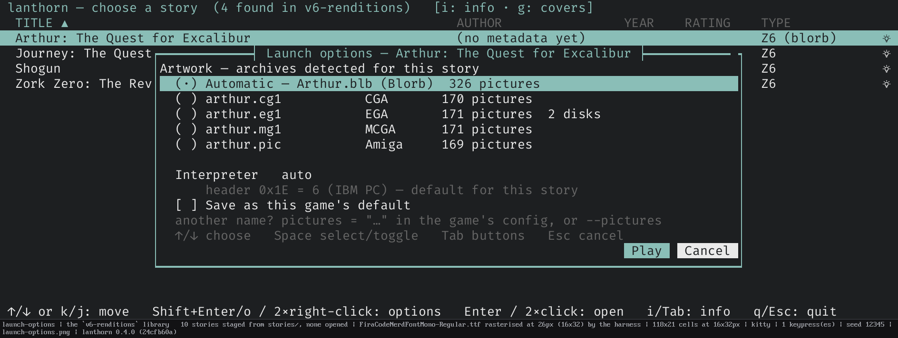
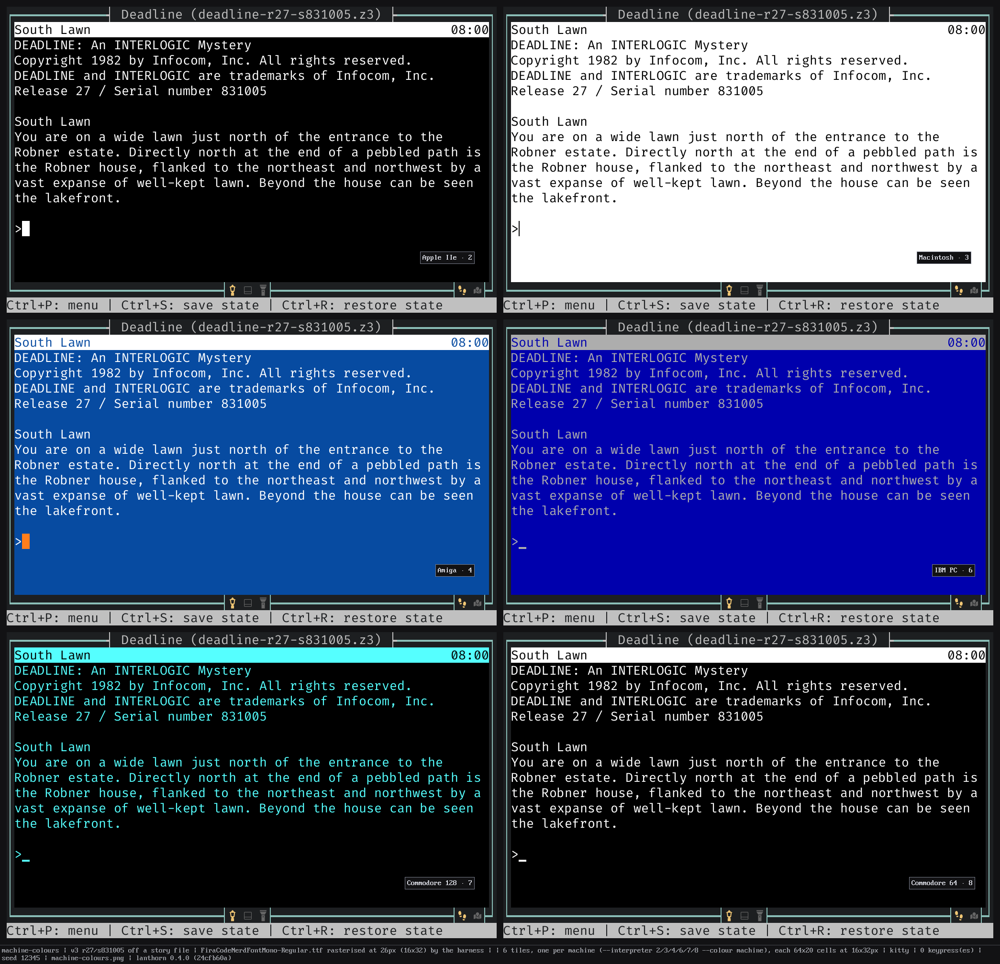

<p align="center">
  
</p>

[](https://github.com/sharkusk/lanthorn/actions/workflows/test.yml)
[](https://github.com/sharkusk/side-quest)

**Play interactive fiction in your terminal while lanthorn draws the map for you — live, as you explore.**

### Supported story formats:

* **Z-machine v3–v8** (incl. graphical v6)
* **Glulx**
* **Scott Adams**

### Supported original Infocom disk formats:

* Amiga
* Mac
* PC
* ST
* AppleII
* C-64/128

---

## See it

**The map draws itself while you play.** A lap of the white house in each
direction — nothing typed but the game's own commands, no annotation, no graph
paper.


**Your library at a glance.** The story picker shows it as a list or as a grid of covers. Press `[TAB]` to
bring up the story info panel.


<details>
<summary>More screenshots</summary>

<!-- SCREENSHOTS: additional stills / GIFs can be dropped in below -->


</details>

---

## Quick start

Grab the archive for your platform from the
[**latest release**](https://github.com/sharkusk/lanthorn/releases) — Linux
(x86_64), macOS (universal), and Windows (x86_64) builds ship with every
release, four binaries in each: `lanthorn` itself plus the no-map CLI players
(`zvm-cli` / `gvm-cli` / `scott-cli`). Extract it and run:

```bash
lanthorn ~/if-games/        # a directory — opens the story picker. The usual way in.
lanthorn zork1.z3           # or straight into one game
```

lanthorn offers to remember the first directory you open, so a bare **`lanthorn`**
goes there next time. It opens disk images too — see
[**Play the original disks**](#play-the-original-disks). `lanthorn --help` has the
flags; the ones people reach for are `--sound off`, `--images off` and
`--image-protocol`.

A URL is a launching shape too, alongside a directory and a disk
image:

```bash
lanthorn https://ifarchive.org/if-archive/games/zcode/curses.z5
```

A web address works anywhere a path does. lanthorn fetches it, opens it like any
other file — story, Blorb, disk image, zip — and then offers to keep it in your
library so the next launch finds it without fetching again.

---

## Try these first

A few things worth doing in your first ten minutes. Everything else can wait.

**In the story picker**

| | |
|---|---|
| **r** | Fetches titles, blurbs, ratings and cover art from IFDB for everything missing them. Do this first — until you do, there is not much for the grid to show. |
| **g** | Flips the list view into a grid of covers. |
| **/** | Searches IFDB by title or author and downloads straight into your library. |
| **Shift+U** | Downloads a story straight into your library from a web address you paste. |
| **Ctrl+F** | Filters your library as you type: title, author, filename or folder. |
| **Enter** on a folder | A library sorted into folders is listed folder by folder; Enter opens one and **Backspace** returns up. |
| **Tab** | Shows the info panel for the highlighted story. |
| **Space** or right-click | Everything you can do to *this* story, in one little menu beside it — open it, launch options, fetch its metadata, get its hints, point it at an IFDB page. |
| **o** | Launch options for this story — which artwork it draws and which machine it plays as (also in the **Space** menu). |
| **?** | Every key the picker knows, on one screen. |

**In the story**

| | |
|---|---|
| **Tab** | Completes from the words *this story* actually knows — no more guessing whether it wants `lamp` or `lantern`. |
| **/** on an empty line | A fuzzy palette over every command. The fastest way to find out what there is. |
| **Ctrl+S** or **Ctrl+R** | Saves and restores the map, the screen and your scrollback — not just the game's own state. |
| **/open-settings** | The settings worth changing, each with a line saying what it does. |
| **Ctrl+P** | The quick command palette. |

And the thing that needs no keys at all: **explore, and watch the map draw
itself.**

---

## What it does

- **Three engines, one player** — Z-machine v3–v8 (including graphical v6),
  Glulx, and Scott Adams, auto-detected from the file. Clean-room, pure Rust, no
  C bindings. → [getting started](docs/guide/getting-started.md)
- **A map that draws itself** — rooms placed, routed and de-overlapped as you
  explore, across switchable layers. Click a room and it shows you the way there.
  Switch on the return probe and it will go and **find
  the way back** for you, in a silent throwaway copy of your game — closing the
  one-way gaps an automap is otherwise full of, and never once assuming that a
  passage runs both ways. A move some games decide at random — Lost Pig's
  gnome tunnels are the example — draws no arrow at all, just a `?` marking
  that the destination varies; hover the little number beside it to see
  where it's actually sent you.
  *Next release:* an Inform 7 game hands over its own world model, so the room
  you wake up in is on the map at the first prompt under the author's own name
  for it, and no room is ever drawn twice because the game spelled its name two
  ways.
  → [the map](docs/guide/the-map.md)
- **The original disks, as the original machines** — hand it an Amiga, Macintosh,
  Apple II, Atari ST, PC or Commodore floppy and it plays the build on that disk,
  with that machine's artwork, sound, palette and status line. Nine machines,
  measured off emulator captures rather than guessed.
  → [Play the original disks](#play-the-original-disks)
- **Graphical v6, drawn properly** — *Zork Zero*'s illustrated frame at an
  authentic 640×400, set in the typeface the original interpreter used, read off
  the media rather than bundled. Three ways to draw it:
  **hybrid** puts text in real terminal cells and art in real pixels,
  **raster** paints the whole pane as one image in the game's own face, and
  **extended** keeps raster's face while growing the story downward instead of
  letterboxing it — a tall terminal gets more rows to read, with the side art
  tiled out of its own artwork at the artist's spacing. `/set-v6-render` cycles
  them. → [graphics and terminals](docs/guide/graphics-and-terminals.md)
- **Saves that remember the whole session** — map, screen and scrollback, not
  just the game's own state, whether you press Ctrl+S or the story does its own
  `SAVE`. Plus Quetzal import/export and per-turn rewind.
  → [saves and rewind](docs/guide/saves-and-rewind.md)
- **A real terminal UI** — mouse, resizable panes, a story picker with IFDB
  search, command palette, in-game InvisiClues, transcript search, a debug
  disassembler, and a theme every part of which you can restyle.
  Click the `◈` on the story pane's border and every
  word already on screen that this story's parser would accept **lights up** for
  a moment — the answer to a room description that names a dozen nouns and
  implements two.
  → [playing](docs/guide/playing.md)
- **A light held up while you play** — Lanthorn's Guiding Light
  offers the words this story's parser knows, the noun you were reaching for,
  and a caution before a move that cannot be taken back. When it suggests a
  word it has already tried it, silently, in a throwaway copy of your own game
  — so it recommends what works where you are standing instead of listing what
  the dictionary holds. It says so once, then marks every later line with one
  glyph in the margin — never in the story's own voice, and never a spoiler.
  `--guidance off`, `/set-guidance`, or the settings screen turns it off.
  → [playing](docs/guide/playing.md)
- **It asks about your font, and sets every icon from the answer** —
  lanthorn writes characters; the font is the terminal's, and
  nothing can ask it whether it has a glyph. So on a first launch it shows two
  rows and asks which one draws properly, then writes the answer into
  `style.toml` as preset names you can still edit. `/run-font-check` asks
  again when you change fonts. A second question follows, about the map's
  diagonal corner glyphs alone, answered independently. → [looks](docs/guide/looks.md)

There is a great deal more than this — proportional fonts off a Kickstart ROM,
Glk sound channels, a click-to-compose command panel, screen-reader output. The
full documentation map — player guide, generated command/key/config reference,
and the internals below — is [**`docs/README.md`**](docs/README.md).

## Playing aids

The story pane's border carries a few clickable switches — the command panel and
the Guiding Light along the bottom, the map at the right, and on a graphical v6
story the render mode and pixel lock along the top. Each shows its state at a
glance, and hovering one names the command it stands for. What you switch there
is remembered per story; the settings screen sets the defaults.

Press **`◈`** (or `/reveal-words`) and every word on screen that the story
knows lights up for a few seconds — a quick way to tell the two nouns a room
actually implements from the dozen it merely mentions. The command panel's
**WHAT** column keeps a running list of the nouns the story has printed so far,
newest first, so something named forty turns ago is still one click away.

→ [playing](docs/guide/playing.md)

## Play the original disks

Hand lanthorn a disk image and it mounts the filesystem, finds the story *and*
everything shipped beside it, and presents the machine that disk came from —
interpreter number, palette, default colours and screen rules together, so a
game that asks what it is running on gets one coherent answer.

```bash
lanthorn "Zork Zero.adf"                      # an Amiga floppy
lanthorn "Arthur.po"                          # an Apple II ProDOS volume
lanthorn "LostTreasures1.iso" --story 3       # a compilation CD
```

| Medium | Extensions | Presents as |
|---|---|---|
| AmigaDOS floppy | `.adf` | Amiga (4) |
| Macintosh HFS floppy, incl. DiskCopy 4.2 | `.image` `.dc42` `.toast` | Macintosh (3) |
| Apple II ProDOS volume | `.2mg` `.po` `.dsk` | Apple IIgs (10) |
| Apple II raw self-booting press | `.dsk` | Apple IIgs (10) |
| Atari ST floppy | `.st` | Atari ST (5) |
| Commodore 1541 | `.d64` | Commodore 128 (7) |
| PC floppy | `.ima` `.img` | — |
| CD-ROM, incl. hybrid Mac/PC discs | `.iso` `.bin` | Macintosh (3) or PC/DOS, per file |
| Commodore 1541, GCR bitstream | `.g64` | Commodore 128 (7) |

**The artwork comes off the disk in the disk's own format**, not from a converted
Blorb — and where a release shipped more than one rendition (MCGA, EGA, CGA, the
Macintosh's monochrome plates), you can pick.



**And the sound.** *The Lurking Horror* and *Sherlock* shipped sampled effects on
their release disks years before Blorb existed, in a format nothing else reads.
lanthorn plays them, pitch-bend and all — so *Sherlock*'s heartbeat really does
beat at three speeds from one recording.


**And the typeface.** *Arthur*'s Amiga floppy carries a real proportional font,
drawn at the game's own per-glyph advances — try `/set-v6-render raster` to see
it. Drop your own `Kick12.rom` or a Mac OS System file into `~/.lanthorn` and the
system faces come too: topaz 8, and Geneva, which lives on no Infocom disk at
all.

**Zips work too.** Hand lanthorn a zip and it opens whatever is inside — a story
file, a Blorb, a set of release floppies — and a zip holding several games lists
them all, like a compilation disc. A downloaded zip of floppies is offered to
your library, unpacked, and launched.

`--colour terminal|theme|machine` chooses whose colours the page and ink start
from: your terminal's, your theme's, or the original machine's.



→ [graphics and terminals](docs/guide/graphics-and-terminals.md)

---

## Terminal support

Cover art, in-game graphics, and v6's illustrated frame render with real pixels
wherever the terminal supports a graphics protocol — and lanthorn auto-detects
which, so you rarely set anything. Full pixel graphics reach **all three OSes**:

| Graphics protocol | Terminals | Platforms |
|---|---|---|
| **Kitty graphics** | kitty, Ghostty, WezTerm | Linux · macOS · Windows |
| **iTerm2 inline images** | iTerm2 | macOS |
| **Sixel** | Windows Terminal **1.22+**, foot, xterm (+ others) | Windows 11 · Linux · macOS |
| *Unicode half-blocks* (automatic fallback) | any terminal, incl. SSH / tmux / plain | everywhere |

Anything without a protocol degrades to half-blocks automatically, so a story is
always playable and the map always draws. Force a path with `--image-protocol`,
or turn images off with `--images off`.

Boxes or blank squares where glyphs should be? That is a font gap, not a bug —
see [**looks**](docs/guide/looks.md) for the font check, and
[**troubleshooting**](docs/guide/troubleshooting.md) for the rest.

---

## Configuration

lanthorn reads `~/.lanthorn/config.toml` (override with `--user-dir`, or point at
a file with `--config`); every setting has a default, so the file is optional.
CLI flags beat the config file, which beats built-in defaults. Saves and sidecars
live under `~/.lanthorn/saves/<story-filename>.save/` by default; `--data-dir
<path>` relocates just those. See
[every setting](docs/reference/config.md) and
[saves and rewind](docs/guide/saves-and-rewind.md).

An **exported transcript** is not quite what is on screen:
lanthorn's own guidance is marked in the margin while you play, and written out
with the word `Lanthorn:` in front of it, because a file has no margin and no
colour.

---

## The command-line players

`zvm-cli`, `gvm-cli` and `scott-cli` play any story in a bare terminal — no map,
no panes, your scrollback intact. Useful over a slow link, for a screen reader
(`--screen-reader` emits zero escape sequences), or for debugging one engine
without the TUI around it. They ship in every release archive.

*Next release:* `lanthorn-mapgen` ships alongside them, and it does the opposite
of playing: hand it a story and it reads the map the game was *built* with —
every room, every exit, no walking — and writes it out four ways, as an
annotated text dump with the map drawn in it, as an SVG, as a Graphviz `.dot`,
and as a documented JSON file for whatever you want to do with it next. Doors
and exits that only open once you've earned them are marked as such. It is
honest about its limits: a passage a game conjures up mid-play was never in the
file to find, and a few games keep their map somewhere nothing can read without
running them — for those it says so and stops.

→ [**the command line**](docs/guide/command-line.md)

---

## Docker

The image runs the full TUI in any terminal with Docker on it, nothing else
installed — or serves lanthorn to a browser on your network:

```bash
docker run -it --rm -v ~/if-games:/stories -v lanthorn-data:/data \
  ghcr.io/sharkusk/lanthorn                  # play in this terminal
docker run -d -p 7681:7681 -p 7682:7682 -v ~/if-games:/stories -v lanthorn-data:/data \
  ghcr.io/sharkusk/lanthorn serve            # then open http://localhost:7681
```

Mount your game folder at `/stories`; saves live in the `lanthorn-data` volume.
`docker compose up -d` with the repo's `docker-compose.yml` does the browser
mode in one line. The browser page ships its own Nerd Font, so icons and map
diagonals draw correctly on any machine, and it scrolls the transcript and map
with a finger drag, so it's usable on an iPad or phone, not just a desktop
with a mouse wheel.

→ [**play in a browser**](docs/guide/play-in-a-browser.md)

---

## Building from source

```sh
cargo build --workspace --release
```

Rust stable, no system dependencies beyond ALSA on Linux (`libasound2-dev`) for
sound. The crate layout, the engine/host seam and the render pipeline are in
[**docs/internals/architecture.md**](docs/internals/architecture.md); testing conventions are in
[**CLAUDE.md**](CLAUDE.md).

## Contributors

lanthorn is better for the people who send it work. Thank you:

- [**@krickert**](https://github.com/krickert) — the Docker build that put
  lanthorn in a browser tab (#2), then folders, a library-wide find and a
  recursive cover grid for the story picker, headless `--fetch` and
  `--import-metadata` for curating a big library, and real game audio in the
  browser (#4).
- [**@dfabulich**](https://github.com/dfabulich) — the return probe: the map
  checks that a passage really leads back the way it came before it draws the
  connection, an idea he sent as a pull request before the project was taking
  them.

Pull requests are welcome — the architecture notes in
[**docs/internals/architecture.md**](docs/internals/architecture.md) are the map, and
[**CLAUDE.md**](CLAUDE.md) holds the testing conventions a change is expected
to follow.

## License

lanthorn is released under the **BSD 3-Clause License** — see [`LICENSE`](LICENSE).
