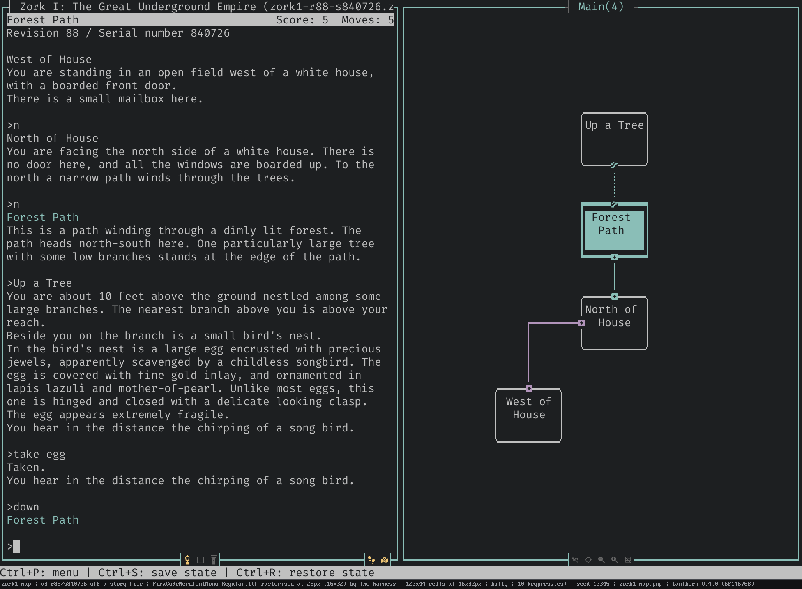

# Live automapping

[← back to README](../../README.md)

Play the game; the map draws itself. Every room you enter and every exit you take
is boxed, connected, and de-overlapped on the fly, then continuously nudged into a
clean layout — no graph paper, no pausing to annotate, no manual placement. Walk
north and a new room slides into place north of where you stood; double back and
the connection closes into a loop. This is lanthorn's flagship feature, and it is
the reason the map pane earns half your terminal.

The mapper is deliberately **engine-agnostic**. It never sees a Z-machine opcode
or a Glk call — it consumes a plain stream of *locations* and *movements* and
turns it into a spatial graph. That means the **same automapper draws every
game**, whether you're charting the Great Underground Empire in *Zork*, threading
*Counterfeit Monkey* in Glulx, or exploring *Adventureland* in a classic Scott
Adams adventure. One map builder, three engines, zero special cases.



## Knowing where you are — across three engines

Before the mapper can place a room it has to be told which room you're in, and
each engine surfaces that differently. lanthorn handles all of it, and records
*how* it worked out each room the first time it finds it — right-click a room to see
"Found by:" in the room dock's Diagnostics body. It is kept with the room, so the answer is
still there long after the turn that discovered it.

- **Classic Z-machine (v3)** reports the room in the status-line variable —
  `via status variable`.
- **v4/v5 Z-machine games that hide it** (Hitchhiker, Bureaucracy, A Mind
  Forever Voyaging) don't expose a room in the classic variable, so the room name
  is read off the status line and resolved back to a game object — preferring the
  player object's room when the game re-parents the player, Inform-style
  (`via player object`), and falling back to a name-only room otherwise
  (`via name match`, or `via name (unlinked)` when it can't be tied to an object).
  A status line can also label several things at once — *The Impossible Stairs*
  reads `Year: 2001  Place: Front Lawn` — and lanthorn does not assume which label
  means "room": each labelled field is offered to the object tree, and the one the
  game recognises as a place is the one mapped, under the name on screen rather
  than the compiler's identifier for it.
- **Games with no room objects to find** (*The Impossible Bottle* and *The
  Impossible Stairs*, both compiled by Dialog; *Facility*; *frankenfingers*) name
  their rooms only on screen — there is nothing in the object tree to tie the name
  back to, ever. A name with nothing behind it is trusted to open a map only when
  the **story itself** printed it too, as a heading in the prose and not just on
  the status bar: real rooms are named twice, in two independent places, while a
  title screen or a character sheet is named once. That is what keeps *Beyond
  Zork*'s character sheet — which shows your name exactly where a room name goes —
  off the map, and it is the same evidence the Glulx side asks for.
  Games that **center** their room title in a custom status display (Beyond Zork,
  Trinity) are parsed too — the centered heading is accepted only once it
  validates against the player's room — so those now automap as well.
- **Graphical v6 Z-machine** (Zork Zero, Shogun, Arthur) has no status line at
  all: the bar is *painted* pixel by pixel wherever the game feels like putting
  it. lanthorn finds it by asking where the prose window starts and reading the
  band directly above it — which is how Arthur works, since it hides its bar
  twelve rows down the screen, tucked under a full-width panel of artwork. The
  glyphs are laid back onto their columns first, because Arthur paints its bar one
  letter at a time; the room then goes through exactly the same checks as every
  other Z-machine game (`via player object`, or `via name match` when the game
  doesn't re-parent you, as Shogun doesn't). Some games never reserve the band at
  all and simply *overlay* the bar on the top row of a full-screen prose window
  (advent.z6): a short, full-width strip pinned to the top of the screen counts as
  the band even though nothing is "above" the prose. A title banner or a right-hand
  date field is never promoted to a room on a name match alone, and Journey — whose
  story window owns the top of the screen and whose menus sit below it — correctly
  reports no room at all (its menu window is the whole screen, not a strip).
- **v6 ports that keep the room somewhere else again.** Brian Howarth's eleven
  *Mysterious Adventures* are Scott Adams games rebuilt as v6 Z-code, and they
  duck every check above at once: nobody is ever put in the object tree (the
  player object's parent stays empty for the whole game), and every room object
  answers to the same compiled name, `ScottRoom`, with the line you actually read
  — "I'm in a dense SPOOKY Forest" — tucked away in a property. What the games do
  keep is a variable holding the room you're standing in, and lanthorn takes it —
  but only after checking that the room it names is carrying, in its own
  properties, the very words on the screen this turn. Object tree and screen have
  to agree, every turn, and no variable is trusted just for being a variable. The
  payoff is an exact room, which matters here more than anywhere: these games
  reuse a description across whole mazes — ten rooms in *Feasibility Experiment*
  all read "I'm in a Tunnel" — and a room known only by its name would fold every
  one of them into a single dot.
- **Glulx (Inform 7)** games often keep the room out of the status bar entirely,
  so lanthorn reads the **Inform room heading** — the bold title line printed as
  you enter a room (`via room heading`). Games like FooFoo and Superluminal
  Vagrant Twin map cleanly this way; rooms are matched by name since the Glulx
  world model isn't introspectable, and pre-game menus or character-setup screens
  correctly produce no room. Front matter is bolded the same way a room is, so
  lanthorn reads the *shape of the page* rather than the words on it: Inform
  joins a room heading to the description underneath it and then hands you the
  **command prompt**, while a title, an act list or a content warning stands
  alone above a blank line on a page that never gets that far. That is why THE
  BAT's act list and its prologue's newspaper strapline don't become rooms, and
  why Adventure in `superbrief` — where a room is a bold line, a blank line and a
  list of what's lying about — still does. The prompt is the test, not merely
  "the game wants typing": Cragne Manor's CONTENT WARNING and CONCEPT WARNING
  pages ask you to *type* yes or no, and read the answer themselves without ever
  printing a `>`, so they stay off the map while Cragne's Railway Platform — the
  first page that does end at a prompt — goes on it.
- **Scott Adams** adventures feed their locations straight through the same
  engine-agnostic pipeline — nothing special to configure.

## Getting around the map

The map is a place you can move through, not just a picture.

- **Zoom** — `zoom-map in|out|reset` (or a signed step) scales between a detailed
  boxed view and a compact overview.
- **Pan** — `pan-map <dx> <dy>` slides the viewport; `center-map` snaps back to the
  selected room, or the room you're standing in.
- **Layer tabs** — multi-level areas are split into named **layers** shown as a tab
  strip across the top of the map (e.g. `Main  Cellar  Maze`, each with its room
  count); the active tab is highlighted, and a layer flagged as a maze carries a
  trailing `⌗` marker (`Maze ⌗`) in both tab strips. `cycle-layer next|prev` switches
  between them. Carving a layer off and folding one back turned out to be the same
  move — *take these rooms and put them on that layer* — so there is one verb for
  both: **`move-region [destination] [direction]`**. `move-region new` carves the
  region onto a fresh layer, `move-region main` folds it back into Main,
  `move-region parent` sends it home to whatever it was carved from, and any layer
  name works in place of those (`move-region Cellar`).
  Everything is anchored on the **selected room** — click one, or `select-room` —
  and *its* side of whatever gets cut is the side that travels. You never have to
  point at an edge, because lanthorn works out which rooms go, in three steps.
  First it walks the compass exits and stops where the portals are: that is a floor,
  a cellar, a tower, and it needs nothing from you but the room you picked. If the
  walk finds no portal to stop at and swallows the whole layer — Zork's underground
  being thirty-odd rooms of solid compass maze — it looks instead at the passages
  leading **into** your room, and cuts the one that is a genuine boundary. Exactly
  one usually is, and it says which: *cut the S passage from At West End of Long
  Hall*. That is the case that used to be unsayable, because the way in may be
  one-way and there is then no direction out of the room that names it. If several
  ways in are real boundaries — you are standing mid-corridor, and cutting east or
  cutting west take opposite halves of the map — it *asks*, offering them by name and
  by size (`e from A (2 rooms)`), because either answer would be a guess. That prompt is
  the only answer that always works: a maze happily has two rooms whose **south** exits
  both land where you are standing (Adventure's does), and no direction you could type
  would tell them apart. You can still name one from the command line when a direction
  does distinguish them (`move-region new e`); a direction that leads nowhere *in* is read
  as the passage leading *out*, which is how you name a one-way exit. The destination
  follows the same rule: leave it off and `move-region` takes the only possible answer
  when there is one, and offers you the choices when there is not. Nothing is ever severed — the passage you cut at simply becomes a
  connection *between* layers, which is why every move goes back the way it came.
  Because the destination is just an argument, a stranded room finally has a cure. A
  room discovered while exploring a maze layer is minted *onto* the maze layer even
  when it is really outside — a back door to the surface, say — so select it and
  `move-region main` cuts it off the maze and sends it home in one go. Rooms
  keep their positions where free; a room whose cell is taken in the destination
  lands on the nearest free one. Two things it will refuse, and it says which: a
  fresh layer for a region that is *already* the whole layer (that would only rename
  it), and anything that would leave `Main` with no rooms at all.
- **The map sometimes speaks first** — twice in a game, lanthorn notices that a set of
  rooms wants to be a layer of its own, and says so. It never acts: layers still come
  only from a `move-region` you asked for. It **suggests**, and you decide.
  The first case is structural: a set of rooms that hangs off one portal and nothing else.
  Two things have to be true of it whichever way you are walking, and each one is a prompt
  you would otherwise have got and not wanted. The cellar must be reachable **only**
  through portals: a balcony you can also walk round to is not behind a boundary at all,
  whatever the `up` says. And it must be **four rooms or more**, because a cupboard behind
  a door is not a floor plan and drawing it in place with a dotted stub is the right answer.
  There are then two moments it can be noticed at, because there are two shapes of cellar.
  Climb down a trapdoor, wander four rooms, climb back up, and *that* is the moment: the
  map has finished being drawn and you are the one who closed it. But Zork's trapdoor
  crashes shut and is barred behind you, and a cellar with no way out would on that rule
  never be mentioned at all — so when the rooms beyond a portal grow into a floor plan
  while you are still down there, lanthorn speaks on the room that makes it four, and then
  goes quiet. One offer per region, not one per room you add to it.
  What it offers is always the side you are **on**, never the side you came from — that is
  the whole safety of asking on the way in. A region only counts as one when every room in
  it was found *after* the room it hangs off, so your starting town, which predates
  everything, can never be what a prompt proposes to peel away.
  The second case is the name. Walk into a room called **Maze** from a room that isn't
  one, and lanthorn says so at the doorway — no four-room floor, no waiting for you to
  return, because the name *is* the evidence and it is there immediately. It fires on
  the way **in**, once, and then goes quiet: Zork's maze is fifteen rooms all called
  "Maze", and asking in each is the nagging this whole design exists to avoid.
  `\bmaze\b`, as a word — "Amazement Park" is not a maze and neither is "Amazed".
  When the rooms look like they belong on a layer that **already exists**, that layer is
  offered too, alongside a fresh one. The evidence is compass edges and nothing else,
  ranked by how many: a region tied to the Cellar layer by two east-west passages is
  probably part of the Cellar. Portals never nominate a home — they are what separates
  layers in the first place, so the `down` you reached the cellar by must not be read as
  proof the cellar belongs upstairs. Grid position is not evidence either; the router
  derives it, so a suggestion built on it could change without the map changing.
  And whatever you answer, lanthorn remembers it, in the map file, against the passage you
  will cross again — the way out when you were noticed leaving, the trapdoor itself when
  you were noticed inside. **Not now** re-arms
  the seam for your next crossing, **never** silences that passage for good, and folding
  a layer back into another silences every passage it just closed — you have already
  said those rooms belong together. A prompt that comes back on the very next step is
  worse than no prompt at all, because it teaches you to dismiss it blind.
  A layer you have flagged as a maze is exempt from the structural trigger outright:
  the point of flagging it was to keep the whole maze together.
  The offer itself is a small modal: what it noticed, which rooms would travel, and the
  destinations on offer as a list you arrow or `Tab` through — `Enter` accepts wherever the
  focus is resting, because landing on a choice already selects it. It says what it noticed
  the way round it noticed it, spelling the passage out: *"You came UP out of Cellar"* when
  you were caught leaving, *"You came DOWN from Living Room"* when you were caught inside —
  and then, of both, the one thing the region walk actually proves, which is that no compass
  passage reaches those rooms. The rooms themselves are a bulleted list, one to a row under a
  count, so the modal grows **taller** for a big region rather than eliding names into a line
  too narrow to hold them. Past eight names it stops naming and starts counting — *"…and 12
  more"* — and on a terminal too short for all of it the list is what gives up rows, never the
  choices or the buttons. Three buttons, and they
  are the three answers: **Separate** does it, **Not now** re-arms the seam for your next
  crossing, **Never** silences that passage for good. `Esc` means *not now* — declining to
  answer is not the same as saying no, which is why there is no Cancel. And it waits its
  turn: a suggestion never shoulders in front of a dialog you opened yourself, and a dropped
  one costs nothing, because nothing is written down until you answer.
- **Switching layers recenters the view** — cycling, clicking a tab, moving a region,
  or loading a map all land the viewport somewhere with a room in it, never on empty
  scroll space: on the room you're standing in if it's on the layer you switched to,
  else the last room you visited there, else that layer's own bounding-box centre. A
  matrix layer selects the same room as its row and scrolls the table to show it.
- **View mode** — `view-map` (leader `u`) switches the active layer between the **drawn**
  map and the **matrix** — the direction table described below. Bare, it cycles; `view-map
  drawn` / `view-map matrix` sets it outright. The choice is per-layer and saved with the map,
  so a maze can stay a table while everything around it stays a map.
- **Room card** — the [room dock](interface.md#the-room-dock)'s Room body (`toggle-room-dock`,
  leader `k`, or left-click a room) lists **every** travel direction, not just the ones that go
  somewhere: where each leads, how it comes back, which you tried and found walled up (`×`), and
  which you have never tried at all (`·`). That is the map's answer to "where haven't I been?",
  one room at a time — and the dock follows you as you walk, so the card is about wherever you
  are standing unless you pin it to a room by clicking one. The twelve directions lay out in up
  to three columns (cardinals, diagonals, portals) when the dock is wide enough, so the card
  costs four rows rather than twelve.
- **Room diagnostics** — `toggle-inspector` flips the same dock to its Diagnostics body: the
  room's id, name, layer, position, and the per-edge layout constraints, so you can see *why* a
  room landed where it did.
- **Hand edits** — select rooms with `select-room next|prev`, `rename-room` /
  `rename-layer`, jot `edit-notes`, or clean up the graph with
  `delete-connection` and `relabel-edge`. Room-number labels toggle with
  `toggle-room-numbers`. Room *positions* are the layout engine's — re-run
  `tidy-map` rather than placing boxes by hand.
- **Export** — take the map with you: `export-svg` writes a scalable vector image,
  `export-dot` emits Graphviz DOT (render it with `dot -Tsvg …`), and `export-map`
  writes the raw structure. Omit the filename for a default path in the game's data
  directory. A saved map can be reopened later with `load-map`.

## Connections that stay readable

A naïve "one arrow per exit" map dissolves into spaghetti fast. lanthorn routes
connections through a lane system with crossing-elimination and overlap removal,
and it understands the awkward cases:

- **Vertical connections** — up/down moves place the new room directly north (up)
  or south (down) of its neighbour, shoving ordinary rooms aside like a compass
  move but yielding to confirmed reciprocal N/S adjacencies. They render as dotted
  connectors with up/down (or stairs) glyphs — never as arrows, never as "distorted"
  red edges. A matching Up+Down pair between two rooms collapses to a single dotted
  path marked at both ends. Where a room pair is joined by *both* a compass direction
  and a staircase, only one line is drawn — see below for which wins.
- **Nautical directions** — ship games (Seastalker and kin) that steer by
  *fore / aft / port / starboard* (plus *bow* / *stern* / *forward*) instead of the
  compass are understood: those map onto north / south / west / east so the vessel's
  decks lay out correctly.
- **Combined multi-direction paths** — two rooms get **one** line between them, however
  many ways you can actually walk it. Zork's around-the-house ring links each pair by
  both a cardinal and a diagonal; Adventure's maze will happily connect the same two
  rooms four different ways, and a staircase often shadows a compass passage. Drawing
  them all means lines that exist only to cross each other, so lanthorn picks a single
  representative: a **reciprocal** pairing first — the two ends are exact opposites, so
  the line runs straight and each arrowhead points the way you really travel — and
  otherwise by direction priority, **N, S, E, W, NE, NW, SE, SW, up, down**. The line
  that wins keeps its own arrowhead (or `↑`/`↓` if a staircase won), and each passage
  that lost stamps its **own glyph beside the shared line's anchor** — a staircase that
  lost to a compass edge shows its `↑` on the border of the room it climbs from, so a
  known way back never disappears into the collapse. Lines carrying more than one
  passage are also tinted with the `shared_path` selector — and the room dock's Diagnostics
  body lists every exit with its direction and destination, so nothing is lost, only
  unstacked.

Where two unrelated connectors still have to cross, the map says so rather than drawing a
junction: the vertical run passes through unbroken and the horizontal one breaks for a single
cell, so a crossing never reads as a place the two passages meet.

Confirmed reciprocal N/S and E/W adjacencies are treated as inviolable: an up/down
move yields rather than shove a reciprocal partner off its shared column or row, and
overlap cleanup may only slide a reciprocal room *along* its own axis, never off it.

## Keeping the layout tidy

The whole map re-optimizes itself as you discover rooms, so it stays readable as it
grows. How eagerly is up to you (`background_tidy`): after every new room (the
default), only when a new room overlaps an old one (`on_overlap`), debounced every
few rooms (`debounced`), or off entirely. Force a pass any time with `tidy-map`.

**Maze layers are left alone.** A layer flagged as a maze (below) is *frozen*: it
schedules no tidy, `tidy-map` on it answers "maze layer: geometry is frozen — the
matrix is the view", and its rooms keep the positions they were first given. There
is no compass arrangement of a maze to converge on — the layout engine would keep
producing a different wrong one every turn, and the pane would keep repainting for a
grid nobody is reading. Only the *optimization* stops: rooms, passages and tried
directions go on being recorded exactly as before, and a newly discovered room is
still placed where the move you walked says it should go, so unflagging the layer
(or switching it back to `view-map drawn`) shows a real map again.

Curious how a layout got built? `animate-tidy` steps through the whole assembly
stage by stage — a **Build** stop that lists every connection, then
**room-by-room placement** as each box drops onto the grid, then the
relayout/overlap-cleanup passes with each move described ("moved 180 to clear
overlap with 193"). Step it with `anim-step forward|back`, play/pause with
`anim-play`, and leave with `anim-exit`. It's equal parts diagnostic and quietly
mesmerising.

## Mazes: the matrix view


A compass map of a maze is a lie told carefully. In one real, half-explored
mapping of Colossal Cave's "all alike" maze — twelve rooms, forty-seven passages —
**two** passages come back the way you went. Eighteen come back by some other
direction, twenty-seven have no known return at all, and the layout engine has to
mark twenty-nine of the forty-seven "distorted" because no arrangement of boxes on
a grid can satisfy them. Eleven of the twelve rooms are called "Maze".

Compass geometry is not what a maze *is*. What you actually know in a maze is a
direction table per room: *west from here goes to that one, and the way back is
north*. So lanthorn will draw you the table.

```
               N     S     E     W    NE    NW    SE    SW     U     D     I     O
──────────────────────────────────────────────────────────────────────────────────
 Maze 1     →5⇠w    ⇢9    ⇢2    ⇢3     ·     ·     ·     ·     ·     ·     ·     ·
 Maze 2       ⇢3   ⇢10  →7⇠n    ⇢9     ·     ·     ·     ·     · →11⇠w     ·     ·
 Maze 3    →11⇠u    ⇢5  →9⇠e →10⇠s     ·     ·     ·     ·    ⇢4     ·     ·     ·
 Dead End¹    ⇄4     ·     _     ·     ·     ·     ·     ·     ·     ·     ·     ·
 Maze 4       ⇢1   ⇄DE  →5⇠s  →6⇠w     ·     ·     ·     ·    ⇢8    ⇢2     ·     ·
 …
▸Maze 11      ⇢8  →7⇠w    ⇢6  →2⇠d     ·     ·     ·     ·  →3⇠n  ⇱out     ·     ·
──────────────────────────────────────────────────────────────────────────────────
¹ Dead End, near Vending Machine
⇱out: D from 11 → At West End of Long Hall
⇲ in:  At West End of Long Hall —S→ Maze 11
```

One row per room, one column per direction — **all twelve, always**. An untried
cell in any direction may be exactly the thing full exploration needs, so none are
hidden however empty the column looks.

| Cell   | Meaning |
|--------|---------|
| `⇄4`   | reciprocal — the compass inverse brings you back |
| `→5⇠w` | goes to 5, and **w**est is the way back (the row is self-contained) |
| `⇢9`   | one-way — no return known |
| `↩`    | self-loop — this direction leads back into this very room |
| `⇱out` | leaves the layer; the destination is footnoted below the table |
| `×`    | tried, and there is no path that way |
| `·`    | untried — the exploration frontier |

A move that got you *killed* leaves no `×` behind. Dying says nothing about whether
the passage is open, so the attempt is taken back and the cell stays `·`, still on
the frontier — including when the game asks whether to reincarnate you before it
admits the death, in which case the move that caused it is the one rolled back.

Nor does *getting up again* leave an edge. A death stays outstanding until the game
says how it ends, however many turns of "Please answer yes or no." that takes, and
the next room change on that side of it is read as the resurrection: the map follows
you to wherever you woke up and mints no passage, because wherever a game drops a
resurrected player is not a way out of the room you died in. Adventure's `yes` →
*"--- POOF!! ---"* → the well house is the case that named it. Exactly one such
relocation is swallowed: play resuming — a room description reprinted where you
stand, or the arrival itself — settles the death, and the next passage you walk maps
like any other.

**Reading it.** `▸` marks the room you are standing in. `⇲` marks a room a passage
from *outside* the layer leads into — a doorway into the maze, listed in a footnote
(`⇲ in:  <origin room> —<direction>→ <target>`) alongside where `⇱out` cells lead.
A room that is both here and a doorway shows `▸`: you are standing there, and the
entrance fact still reads in the footnote. Rooms sharing a display name are
numbered in the order you *found* them — "Maze 1" is whichever one you walked
into first, not whichever has the lowest id. That matters because the id is often
the story's own object number, which has nothing to do with when you found the
room: a number is minted the moment a room is first discovered and never changes
again, so finding a "new" duplicate that happens to have a lower id never
renumbers the ones you already know. Rows are in that same order, so a row's
position and its own number always agree. The numbering is otherwise
display-only — identity is still the room's own id — and it is stable across a
reload; a save from before this was tracked settles its numbers, once, to your
true visit order (each room's position in the save file), the first time it
reloads. Names too long for the label column are abbreviated and spelled out in a
footnote.

**Selection** moves with ↑/↓ (or Home/End, PageUp/PageDown) when the map pane has
focus, or by clicking a row. Clicking a *destination cell* jumps the selection to
that room's row. Selecting a room **bolds every cell elsewhere that arrives at it**
— its known entrances, which is the answer to "how do I get back here", and the one
question a row cannot answer about itself. That highlight is style, never a glyph:
the table's text does not change.

**Clicking a room also shows you the way there.** lanthorn searches the map for the
shortest route it already knows how to walk, from the room you are standing in to
the one you clicked, and marks **one cell per step: the row of the room you are in,
in the column you leave by**. Read the marks top to bottom and you have walking
instructions — and because it is the *leave-by* cell that lights up, each one keeps
its own glyph, so you can still see whether the step you are about to take comes
back or does not. It wears its own colour (`map.matrix.cell:path`), deliberately
unlike the entrance bolding beside it: the two answer opposite questions, and they
routinely light up in the same row.

The search walks passages only in the direction you walked them, so a one-way
corridor is never offered backwards — a route lanthorn shows you is a route you can
actually walk. It searches the *whole* map rather than just this layer, because a
layer is a way of reading rooms, not a wall between them; steps that land on other
layers simply have no row here to draw on, and where the route walks out of this
layer the `⇱out` cell it leaves by is the one marked (that cell already footnotes
where it goes). The view never jumps layers behind your back. If there is no known
route at all, the room still selects and lanthorn says so rather than falling
silent — a half-route to somewhere nearer would be answering a question you did not
ask.

`Esc` backs out one step at a time: the first press clears the route and leaves the
room selected with its entrances still bold, the next unpins the room, the next
closes the room dock.

**Narrow panes** degrade before they scroll. First the `⇠x` return suffixes drop
(cells shrink to `→5`, and the return is still readable on the destination's own row
and in its room card); only when even that will not fit does the table scroll
sideways, with the label column pinned. The thresholds are computed from the table's
own contents — there is nothing to configure.

The matrix is also the one map view a screen reader can read: a table linearises
where a drawing cannot.

### Marking a maze

`mark-maze-layer` (leader `z`) flags the active layer as a maze. The flag moves the
layer's *default* view to the matrix; it never overrides a `view-map` you chose by
hand, and unflagging puts an unchosen layer straight back to drawn. On a
maze-flagged layer the last few rooms you walked through are also highlighted as a
fading breadcrumb (`map.trail`) — the "how did I get here" a drawn map would have
answered by itself. The flag also puts a `⌗` marker on the layer's tab (`Maze ⌗`) in
both tab strips, and takes it away again when unflagged.

**The flag is always yours to set.** lanthorn never guesses from *statistics* — you
are in the maze long before any measure of tangledness could tell, which is why the
old asymmetry detector fired late, never, or on an ordinary ring of rooms. So the
moment you decide "this is a maze", press `z`; there is nothing to wait for.
What it *will* do is read: walk into a room the game itself calls a **Maze** and the
map offers to take it apart into a layer of its own — see [the map sometimes speaks
first](#getting-around-the-map). Accepting that offer sets this flag too, because you
just confirmed it by accepting a prompt that said so. Accepting a *structural*
suggestion sets nothing: a cellar is not a maze.

### Honest edges on the drawn map

The same asymmetry shows up outside mazes, so the drawn view stopped pretending
too, under one rule: **every arrow on a room border is that room's own exit** —
arrows are only ever outgoing. A two-way corridor wears each room's departure at
its own end; a **one-way** passage wears exactly one, at its origin, and the line
ending *bare* on the destination is the reading — you can get there, and nothing
known brings you back. One-way and
disagreeing-direction edges each have their own style selector (`map.edge:oneway`,
`map.edge:asym`), both defaulting to the ordinary connector so nothing changes
appearance until you choose to style it. A **self-loop** draws as a compact `↩w`
badge on the room box, never as a line looping out and back: a loop has no
geometry, and a drawn one would need its own lane to say less than three characters
do.

## Finding the way back, without guessing it

A map built from your moves learns a passage one direction at a time. Walk north
into a clearing and the map knows how you got there and nothing about how you
leave; half the rooms on a map you have walked through once hang off a single
arrow. The tempting fix is to assume passages run both ways, and it is wrong
often enough to be worse than the gap — these games are full of one-way drops,
doors that open from one side, and mazes whose entire design is that the way back
is not the way you came. A guessed arrow is the map asserting something false,
and nothing on screen tells you which arrows were walked and which were assumed.

So the **return probe** finds out instead. After a move that
leaves a gap lanthorn forks the story into a silent throwaway copy — the same
shadow the Guiding Light vets its word suggestions in — stands it exactly where
you are standing, and walks one direction. If it comes out in the room you just
left, that passage is real and joins the map. If it comes out anywhere else,
**nothing at all is recorded**: not the edge, not the room it wandered into, not
that the room exists. The map stays a record of what *you* have seen.

It leads with the way you came and widens from there — the opposite of your move,
then the two directions perpendicular to it, then the two diagonals beside it,
then everything else, twelve in all. Zork I's North of House is the case worth
knowing: south is boarded up and east is somewhere else entirely, and it is
**west** that takes you home. The search walks past the refusal and past the
wrong room to find it, and Behind House — which it really did walk into — never
appears on your map.

Three things it is careful about:

- **It never marks a direction as tried.** That record is yours, and it is what
  the matrix view's `·` frontier is drawn from. A direction a shadow walked on
  your behalf is still a direction you have never explored, and the map goes on
  offering it.
- **It never claims the reverse.** Climbing through the kitchen window in Zork I
  is still `enter window` on the map, whatever direction brings you back out. The
  return passage is recorded as its own edge, and the geometry that follows from
  it — the kitchen sitting west of Behind House — is the layout's business, not a
  second passage.
- **It gives way to you.** Walk the way back yourself while a search is running
  and the search stops: what you actually did is the better evidence, and it is
  already on the map.

The work happens on a worker thread, so the story answers you at once and the map
catches up a beat later. Every direction it tries is remembered *permanently*, so
a room is searched once in the life of a map rather than once per visit, and a
search you interrupt by walking on resumes where it stopped.

It is **on by default** — the probing shares the snapshot the turn already
takes for its own bookkeeping, so it costs the move almost nothing — and the
footprint on the **story** pane's bottom border, immediately inboard of the map
toggle, is its switch: muted when off, lit when on, and never hidden. It
lives there rather than on the map's own border for a reason worth stating: the
search keeps running while the map is hidden — hiding a view must not degrade the
data behind it — so its only switch cannot sit on a pane that disappears. `/set-return-probe` does the same from the keyboard,
and both remember the answer for *that story*, so you can afford it on a small
Z-machine game and decline it on a large Glulx one.

## Making it yours

Every glyph the map draws is a themeable preset in the `[map]` section of
`style.toml`, right alongside the map's colours — swap the whole look without
touching a line of code:

- `box_style` — room outlines: `rounded` (default), `thick`, `double`, `solid`,
  `super-thick`, `ascii`, or `borderless`.
- `arrow_set` — connector arrowheads: `filled` (default), `line`, or a family of
  Nerd Font sets (`nerdfont`, `nf-bold`, `nf-box`, `nf-chevron`, `nf-circle`,
  `nf-outline`) for patched fonts. `nerdfont` — what the font check installs when
  you tell it your terminal draws row 1 — is the boxed set, the same glyphs as
  `nf-box`: an arrowhead sits *on* a line of path glyphs, and a box gives it an
  edge of its own where a bare chevron reads as one more bend in the path. All
  eight directions come from one icon family, diagonals included. `nf-chevron`
  keeps the older bare chevrons for anyone who preferred them.
- `path_style` — the line-art that draws the cardinal (N/S/E/W) connectors:
  `light` (default), `heavy`, or `dotted`.
- `portal_path_style` — the same three presets, applied on their own to the
  up/down/in/out portal links: `dotted` (default) keeps the familiar ┊/┄ threads.
- `portal_icons` — up/down/in/out markers: `ascii` (default: `↑ ↓ ◉ ◎`), `nerdfont`,
  or `nerdfont-stairs` for distinct stairway icons. The in/out pair is deliberately
  drawn from Geometric Shapes rather than the `⊙`/`⊗` of Miscellaneous Mathematical
  Operators, which plenty of monospace faces — Fira Code among them — simply do not
  carry; `portal.in` and `portal.out` override either one on its own.

The matrix view has its own selectors beside the map's colours:
`map.matrix.header`, `map.matrix.row:here`, `map.matrix.row:selected`,
`map.matrix.cell:entrance` (the bold cross-highlight), `map.matrix.cell:path` (the
route to the room you clicked), `map.matrix.cell:frontier` (the dimmed `·`/`×`
cells) and `map.matrix.footnote`; `map.trail` colours the maze breadcrumb.

Individual glyphs can be overridden one at a time in `[map.overrides]`, and
`diagonal_corners = false` drops the half-diagonal corner stubs (🮠🮡🮢🮣, Unicode 13
Legacy Computing) in favour of plain orthogonal corner exits — the escape hatch
for a font that has no glyphs for them. Reload changes live with `reload-style`. See
[customization & configuration](customization.md) for the full styling surface, and
[interface](interface.md) for mouse-driven map navigation.
