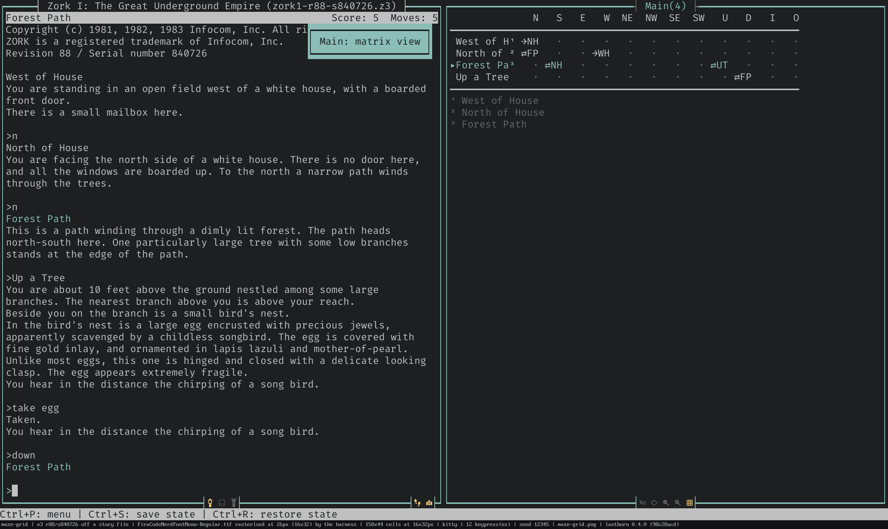

# The map

For anyone who wants to explore without drawing their own graph paper — this
page covers what the automap does on its own, and how to drive it once it's
drawn.

lanthorn watches where you are and where you've been, and it builds the map.
Walk north out of a room and a new room slides into place north of you; double
back and the connection closes into a loop. Nothing to type, nothing to
annotate — the moment you enter a room lanthorn has already boxed it,
connected it, and nudged the layout to stay clean.

The same automapper draws every game. It never reads a line of the game's own
code — it just watches where you are and where you go — so whether you're
threading the Great Underground Empire in *Zork*, Counterfeit Monkey in
Glulx, or a classic Scott Adams adventure, one map builder handles all three.
Working out *where you are* is the part that differs by engine — a v3 game
states it outright, later Z-machine games hide it in the status line,
graphical v6 games paint no status line at all so lanthorn reads the band
above the story window, and Glulx games get it from the bold room heading
Inform prints as you enter — but you never configure any of it.

**Getting around.** `/zoom-map in|out|reset` scales between a detailed view
and a compact overview; `/pan-map <dx> <dy>` slides the viewport and
`/center-map` snaps back to wherever you're standing. Multi-level areas split
into named layers shown as tabs across the top of the map pane —
`/cycle-layer next|prev` moves between them. Click a room, or use
`/select-room`, to select it and open its room card, which lists every
direction out of that room, where each one leads, and which you've never
tried.

**Connections that stay readable.** A "one arrow per exit" map turns to
spaghetti fast, so lanthorn routes connections through lanes that eliminate
crossings and overlaps. Two rooms linked several ways — a compass direction
and a diagonal, a staircase shadowing a corridor — collapse to a single line,
and the passages that lost the collapse stamp their own small glyph beside it,
so nothing is hidden, only unstacked. Up and down moves get dotted connectors
with stairway glyphs rather than arrows. And every arrow is honest: it marks
that room's *own* exit, so a one-way passage wears an arrowhead only at its
origin — nothing known brings you back, and the map says so rather than
guessing.

**Keeping it tidy.** The whole layout re-optimizes as you explore.
`background_tidy` controls how eagerly — after every new room (the default),
only when rooms start to overlap, debounced every few rooms, or off entirely —
and you can force a pass any time with `/tidy-map`. Room positions belong to
the layout, not to you: there's no dragging a box into place by hand, only
asking `/tidy-map` to try again. lanthorn also notices, at most a couple
of times in a game, when a cluster of rooms wants to be its own layer — a
cellar reachable only through one portal, or a room the game itself names a
"Maze" — and offers to split it off. It never acts on its own: separate it,
put it off for now, or tell it never to ask about that passage again.

**Mazes get a table, not a lie.** A compass-drawn maze is a lie told
carefully — real "all alike" rooms have passages that don't come back the way
you went, arrive from a direction you never expected, or lead nowhere at all.
`/mark-maze-layer` (leader `z`) flags the active layer as a maze and switches
it to the matrix view instead: one row per room, one column for each of the
twelve directions, showing exactly what you've learned — a destination and
its way back, a one-way passage, a tried dead end, or a direction still
untried on the frontier. Selecting a room bolds every cell elsewhere that
leads back into it, the one thing a maze's own row can't answer about itself,
and clicking a room draws you the shortest known route there, step by step.
Hover a row's name or a cell's destination tag and a tooltip spells out the
full room name, for the ones the label column had to abbreviate. The label
column itself grows to fit the room, wide pane permitting — abbreviation and
its footnote only kick in once a name genuinely runs out of room.

The drawn view hovers too: a room whose name keeps changing carries a small
number beside its label, and hovering it lists the room's other names. A
random exit shows its own arrowhead on the border, same as an ordinary
passage, with a count — or a bare `?` before anything's been recorded — sitting
just outside it where the path would start; hover either cell and it lists
every room that direction has actually landed you in so far. And when several
exits from a room all lead to the very same place, only one arrowhead is
drawn, picked out with a highlighted accent — hover it to see every direction
that gets you there.

**Finding the way back.** Half of what you've walked through hangs off a
single arrow — you know how you got in, not how you'd get out. Assuming a
passage runs both ways would be worse than leaving the gap, since these games
are full of one-way drops and doors that open from only one side. So the
**return probe** checks instead: after a move that leaves a gap, lanthorn
forks your game into a silent, throwaway copy, stands it where you're
standing, and walks the direction that would bring you back. Land in the room
you just left and that passage joins the map for real; land anywhere else and
nothing at all is recorded — not the edge, not even that the room exists. It's
on by default, and the footprint control on the story pane's bottom border
shows whether it's currently running; toggle it per story with
`/set-return-probe`.

**Click the compass, walk the map.** A graphical v6 game paints its own
compass rose into the frame around the story — *Zork Zero*'s sits in the banner
overhead — and those spokes are live. Click one and you walk that way, exactly
as you would have on the original machine. The automap comes along for the
ride: the game echoes the direction it acted on, lanthorn takes that echo as
the turn's move, and the edge is drawn and the direction marked tried, as if
you had typed it yourself.

**Making it yours.** Every glyph the map draws — room outlines, arrowheads,
path style, portal icons — is a themeable preset, and the portal glyphs travel
beyond the map: the command panel's one-click up/down/in/out cluster draws the
same four. See [Looks](looks.md) for picking a look you like.

## Going deeper

- [Mapping](../internals/mapping.md) — how rooms are placed, routed and de-overlapped as you explore
- [Interface](../internals/interface.md) — mouse-driven navigation and the pane borders
- [Style reference](../reference/style.md) — every glyph the map draws, and how to restyle it
