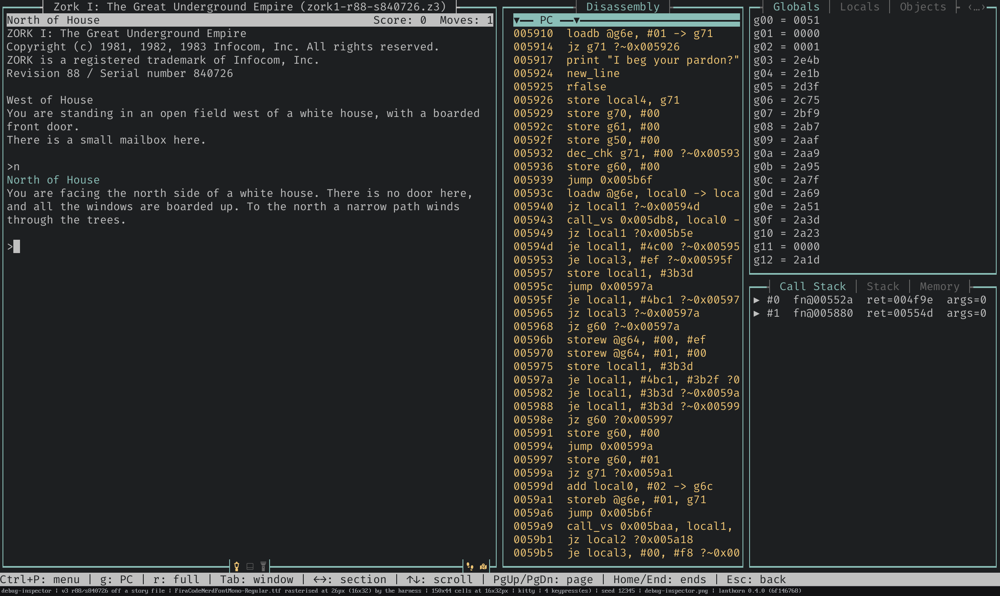

# Interface: navigation, playing aids & story picker

> For players, the short version is in [the guide](../guide/playing.md).

[← back to README](../../README.md)

The map draws itself, but you still have to drive it. lanthorn gives you a
mouse-driven, copy-anything, keyboard-fast terminal cockpit for reading the map,
inspecting the machine, and firing commands — without ever leaving the story.

## Map navigation & inspection
- **Mouse support** — left-click a room to point the [room dock](#the-room-dock)
  at it; right-click a room for its layout diagnostics; middle-drag anywhere to
  pan the whole map around. The dock never interrupts the game: it reserves rows
  at the bottom of the map pane rather than covering anything, so the keyboard
  stays on the story prompt and you can keep typing and pressing Enter with it
  up — handy for watching a room's exit card fill in as you walk. On a layer
  showing the [matrix view](mapping.md#mazes-the-matrix-view) the same click
  selects a row — and a click on a destination cell jumps the selection to the
  room it names.
- **Mouse wheel** pans the map (hold Shift for horizontal, Ctrl to zoom) and
  scrolls every other scrollable surface too — the transcript and the lists
  inside modals (saves, file browser, gallery, config, command palette, the
  IFDB search results, the command band's columns, …). On a list the wheel
  scrolls *the list*, not the
  cursor: the highlight stays on the row you left it on and the rows slide
  under it, and only when the window would carry it off the screen does it
  come along, riding the top or bottom row. The keys work the other way round
  — `↑`/`↓` move the cursor and the list follows it — which is why a wheel is
  for browsing and an arrow is for choosing. A list that already fits its
  window has nothing to scroll, and the wheel there does nothing at all — and
  when that list is inside a dialog, the notch stops there rather than quietly
  scrolling whatever is behind it.
- **A scrollbar that gets out of the way** — every scrollable surface draws the
  same bar, and it is drawn as *colour*, not as a glyph: thumb and track are
  background fills, so a line of prose ending one column short of it has a clean
  gutter instead of a full block leaning on it. In the **story pane** the bar
  also auto-hides. It appears when you actually scroll — wheel, `PageUp`/
  `PageDown` and the other scroll keys — holds for a moment, then fades out. New
  game text never summons it (that would flash a bar at you every turn), and
  nothing reflows when it goes: the story bar lives in the pane's margin band,
  outside the text. Modals keep theirs permanently, because a modal's gutter is
  taken out of its list width and hiding it there *would* reflow the list. Tune
  it with `scrollbar_hide_ms` / `scrollbar_fade_ms` under `[animation]`, or set
  `scrollbar_hide_ms = 0` to keep the story bar up for good.
- **Select & copy text** — left-drag across the story pane to select transcript
  text, highlighted live as you drag; let go and it lands on your system
  clipboard via the OSC 52 terminal escape — so a selection copies cleanly even
  over SSH, with no clipboard library in the loop. Each row is clamped to the
  story pane's columns, so a drag never scoops up the map beside the text.
- **Drag a pane boundary to resize it** — grab the divider between the story and
  map panes, or the top edge of the inventory dock, the command band or the room
  dock, and drag.
  The boundary lights up as the pointer crosses it, the panes follow the pointer
  live, and the new size is written to `config.toml` when you let go. What you
  press the button on decides what the drag means: a drag that starts on a
  boundary only resizes, and a text selection that starts in the transcript keeps
  selecting even when it crosses one. For the keyboard, `/resize-panes` enters
  resize mode — **Tab** cycles which boundary is live, the arrows move it, `0`
  resets, **Esc** leaves.
- **The room dock** — one panel at the bottom of the map pane describing one
  room, opened with `k` from the leader panel or `/toggle-room-dock`. It has two
  bodies:
  - **Room** — the room's notes, its [exit card](mapping.md#room-card) in the
    matrix vocabulary, and the objects the engine can see there. The card spends
    the dock's WIDTH rather than its height: the twelve travel directions lay
    out in up to three columns — cardinals, diagonals, portals — so the whole
    card is four rows on a normal map pane and falls back to the single column
    on a narrow one.
  - **Diagnostics** — id, layer, grid position, and the per-edge
    dropped-constraint flags, so you can see *why* the layout engine placed a
    room where it did. `/toggle-inspector` opens straight onto this body, and
    flips back to Room when the dock is already up.

  The two names sit in the dock's tab strip — the same strip, and the same
  click, as the map pane's layer tabs: click either name to switch bodies.

  **It follows you by default.** With nothing selected the dock describes the
  room you are standing in and updates every move — the header says `◇ following`.
  Click a room to **pin** it (`◆ pinned`) — hollow while it moves with you, filled
  once it is fixed, and both settable as `dock.following` / `dock.pinned` in
  `style.toml`; the dock then holds that room while
  you walk on. Pinning is just selecting, so the map highlight and the matrix
  cross-highlight always agree with the dock. **Unpin** — back to following — by
  clicking the pinned room again, clicking empty map space, or pressing **Esc**;
  a second **Esc** closes the dock. It is not a modal, so it costs you nothing to
  leave up: it never takes the keyboard and it never hides the prompt.
- **The map never takes the keyboard.** Every keystroke goes to the story, so a
  key always means the same thing — you never have to look at which pane is
  "active" before pressing an arrow. The map is driven alongside your typing
  instead: `Shift+Arrow` pans, the mouse pans/zooms/selects, and zoom and
  centring live on the `Ctrl+P` leader panel's **Map** group. **Tab** / **Shift-Tab** are only
  live when the debug inspector is open, where they step through its windows.
  Show or hide the map entirely with `/toggle-map`.

## Debug inspector (Z-machine)

`/debug` turns the map pane into a live **Z-machine debug inspector** — a
built-in debugger that follows the running story instruction by instruction.



- **Live disassembly** that tracks the program counter, with a `PC` divider
  marking the next instruction about to execute.
- **Three tabbed windows.** A full-height **Disassembly** column fills the left.
  The right stacks two tabbed windows: a top window (**Globals** by default,
  plus **Locals**, **Objects**, and **Dictionary**) and a bottom window (**Call
  Stack**, **Stack**, and **Memory**). **Tab** / **Shift-Tab** move focus one
  window at a time — the story pane and each debug window are stops in the same
  cycle — **←**/**→** switch the sub-tab inside the focused window,
  **↑**/**↓** scroll it, **PgUp**/**PgDn** move it a screenful at a time, and
  **Home**/**End** go to its ends — the top, and as far as it will go. The two
  address-anchored views ask the engine where their ends are, so **End** in the
  Disassembly lands on the last unit the disassembler holds and **End** in the
  Memory view on the last full sixteen-byte row.
- **A hint bar that follows the tab you are on.** The bottom row leads with the
  keys that only work in the section you are looking at — `g` and `r` in the
  Disassembly, `h`/`l` and `:` in the Memory view — and puts the universal Tab
  / arrows / paging / Home-End / Esc after them. The row truncates from the right when the pane is
  narrow, so the local keys are the ones that survive; before, a fixed list
  advertised the pan in tabs that cannot pan and hid it in the one that can.
- **Opcode hover help** — hover an instruction and a tooltip decodes the opcode
  and every operand: what each argument is, and where the result lands.
- **Click-to-jump operands** — addresses in the disassembly are underlined and
  jump to their target (code, memory, object, global, or local); `g` recenters
  on the PC, and `r` cycles the disassembly render mode (Full → Basic → Raw). In
  the Memory tab, `:` or `/` opens an address box that also accepts a variable
  token (`sp`, `g44`, `local10`).
- **Decoded story text beside the hex.** Past the usual character column, each
  Memory row carries the story's own words for its bytes — `lantern` sitting
  beside the sixteen bytes that encode it. The character column can't show you
  this: it reads one byte as one character, while a dictionary key and an
  object's short name are Z-encoded, three characters packed into every 16-bit
  word, so that column is noise over exactly the entries the Dictionary and
  Objects tabs let you jump to. Style the column with `debug.zstring`.

  It only ever fills in rows it can vouch for. Z-text has no resync point — the
  decoder carries an alphabet shift and a half-finished abbreviation across word
  boundaries — so text decoded from a row boundary part-way into a string is
  *wrong*, not merely shifted, and reads perfectly plausibly. Rows the story's
  own tables anchor (dictionary keys, object short names) get their real text;
  every other row is left blank rather than guessed at.
- **Horizontal scrolling in the Memory view.** A hex row is 72 columns before its
  decoded text even begins, and no inspector window is that wide. `h` and `l` pan
  the dump sideways (the arrows are the section cycler, so panning takes the
  vi keys, the same trade the animation view makes), clamped to the widest row.
  **Shift+wheel** pans it too — and like every other wheel gesture in the
  inspector it goes to the window under the cursor, so you can pan the hex dump
  without first tabbing focus onto it. A trackpad's sideways swipe (or any
  terminal that forwards a real horizontal wheel) pans it with no modifier at
  all. The `addr:` line above stays put — it's a control, not part of the dump. A
  scrollbar along the bottom of the pane shows how far along the row you are and
  how much is still out to the right — the same themed bar every other
  scrollable surface uses (`scrollbar` and `scrollbar_track`). It appears only
  when a row really is wider than the pane, and costs the dump no row when
  everything already fits.
- **An object row jumps to its name.** Clicking an Objects row lands the Memory
  view on that object's *property table*, so the first thing you see is the
  length byte and the object's own short name decoded in the Z-string column
  right beside it. The object's entry — the attribute flags and the tree links —
  holds no text at all, so it lives one step further in: expand the object and
  its detail leads with a clickable `entry @0x……`.
- **Execution coverage.** Once a line's address runs it turns blue and stays
  blue for the rest of the session, so you build up a map of what has actually
  executed; a `|` gutter bar additionally marks just the lines the *last* command
  ran. Launching with `--debug` opens the inspector automatically and traces from
  the very first boot instruction — capturing the game's start-up code a mid-game
  `/debug` would miss — and saves the accumulated coverage per story, so a later
  `--debug` (or a plain `/debug`) starts with the earlier runs' lines already blue.
- Select-and-copy works inside the inspector exactly as it does in the
  transcript. `Esc` closes it and restores the map.

### Scott Adams inspector

`/debug` (and `--debug`) work for Scott Adams stories too — the inspector
retargets itself to the way a Scott game actually thinks. There is no program
counter here; a Scott game *is* its **action table**, so the inspector puts that
table front and centre and drops the sections that only make sense for a
register machine (no call stack, eval stack, or linear memory).

- **Actions** (the left column) decompiles the action table one rule per line —
  `VERB NOUN  if CONDITIONS -> COMMANDS`, with items, rooms, flags, and messages
  resolved to their names. `r` still cycles Full → Basic (mnemonics, raw
  operands) → Raw (the bare numeric verb/noun/condition/command tuples), and
  hovering a rule expands it to the full `IF …` / `THEN …` listing.
- **Coverage, Scott-style.** Instead of executed program counters, the blue tier
  and `|` gutter mark **actions that have fired** — cumulatively (blue) and on
  the last command (the bar). An action whose verb and noun matched your command
  but was stopped by a failing guard is flagged inline with a `✗cond` suffix, and
  its hover names the condition slot that blocked it — a quick answer to "why
  didn't that work?". `--debug` traces from boot, so the opening auto-events are
  captured, and coverage persists per story exactly as for the Z-machine.
- **The right-hand tabs** carry Scott's world: **State** (current and saved room,
  lamp fuel, darkness, the live counter, set flags, and what's carried),
  **Items** (every object with its start location), **Vocab** (the verb and noun
  vocabularies with their synonyms), and **World** (every room with its exits,
  followed by the message table).

### Glulx inspector

`/debug` (and `--debug`) light up Glulx stories too — and here the inspector is
in its element, because Glulx *is* a register machine. The full layout survives:
a live **Disassembly** column anchored on the PC, a
real **Call Stack** and **Eval Stack**, the innermost frame's **Locals**, and a
**Memory** hex view you can jump anywhere in with `:` (raw Glulx addresses,
absolute — the ROM/RAM boundary is flagged with a `<RAM>` marker so you always
know which side you're on).

- **A disassembler that discovers.** Glulx code isn't laid out for a reader, so
  the inspector maps the image first: it follows the call graph from the start
  function, then type-validates a linear scan of the rest. Every instruction is
  tinted by confidence — solid for code reached from the start function, dimmer
  for a scan-only guess — and any address the story *actually executes* is
  promoted to certain on the spot. Call, branch, `jumpabs`, `streamstr`, and
  `glk` operands are annotated inline: a call shows its target, a `glk` shows the
  named selector (`glk_window_open`), a string print shows a snippet of the text.
- **Where the PC parks, and how to get somewhere interesting.** The panel
  refreshes between turns — and between turns a Glulx story is *always* suspended
  in the same spot: the `@glk glk_select` inside Inform's Glk veneer, a
  three-instruction shim (`copy sp, L0` / `glk #0xc0, L0, L4` / `return L4`) that
  pops the Glk argument count, dispatches, and returns. So the PC anchor reports
  the same address every single turn (`00049a` in *Coloratura*, `00103c` in
  *Counterfeit Monkey*), and the instructions around it are dispatch glue rather
  than story logic. That is the machine's honest state, not a mis-decode: it
  really is parked there, and the shim really does disassemble that way. To land
  in the game's own code, click a **Call Stack** `ret=……` address — the frames
  beneath the veneer carry real return PCs into the story. PC-follow re-anchors
  on the next refresh, so re-click after each turn.
- **Three repurposed tabs** trade the Z-machine's object world for Glulx's:
  **Functions** lists every discovered routine with its entry address, `C0`/`C1`
  calling convention, local count, confidence tier, and — for the well-known
  accelerated routines the VM shortcuts natively — an `[accel: Z__Region]` badge.
  **Strings** lists the discovered string objects (plain, compressed, or Unicode)
  with a decoded preview. **Glk** shows the live window tree, the same snapshot
  `/dump-windows` prints. Each row leads with a clickable address: a Functions
  row jumps straight to that routine in the Disassembly; a Strings row jumps the
  Memory pane. Call Stack return addresses (`ret=……`) are click-to-jump too, for
  the same Disassembly target.
- **Coverage and boot tracing** work exactly as elsewhere: the blue tier marks
  instructions ever executed, the `|` gutter marks the last turn, and `--debug`
  traces from the very first boot instruction (so an I7 game's lengthy startup is
  captured, which a later `/debug` toggle would miss) and persists coverage per
  story. Discovery is lazy — it runs once, the first time you open the inspector,
  and never touches a normal launch.

## Playing aids
- **Toggle controls in the pane borders** — clickable icons riding a pane's
  own frame, each one showing what state it is in and switching it when
  clicked. There are two clusters — the story pane's, described first, and the
  **map pane's own five** further down — and one mechanism behind both.
  Guidance, the command band and the two v6 switches used to be reachable only by
  slash command, key or the settings screen, with nothing on screen saying they
  existed, let alone whether they were on.

  ```text
  ┌─ ZORK I ──────────────────────┤ ◧ □ ├─┐   the v6 pair (v6 stories only)
  │                                       │
  └──────────┤ ○ ▲ ◈ ├──────────┤ ◌ ◀ ├────┘   band · light · reveal | probe · map
  ```

  - **A control sits where the thing it governs is, or where it would appear.**
    The command band opens *below* the story pane, so its toggle rides the
    bottom border; the map lives to the *right*, so its toggle takes the bottom
    border's right-hand end, nearest the pane it summons. The Guiding Light has
    no direction of its own and joins the band as the other thing you switch,
    and the **reveal** joins them both — it acts on the story pane's own prose,
    right there.
    The **render mode** and the **pixel lock** govern how the story pane itself
    is drawn, so they keep that pane's own top border — and they appear only
    when the story really is v6, absent rather than greyed out, so an ordinary
    story's top border carries nothing at all.
  - **The state is carried twice: by the glyph and by the colour.** The panel
    toggles are arrows pointing the way the panel would move, so `▶` means
    "click and the map leaves that way" while `◀` means "click and it comes
    back", and `▲`/`▼` say the same for the band. The Guiding Light is a filled
    `●` when lit and a hollow `○` when out; the render mode draws `◧` hybrid,
    `■` raster, `▦` extended; the pixel lock `▣` locked, `□` free. On top of
    that, **every control that is on is lit yellow** — the `alert` role, the
    same slot the Guiding Light's own margin mark uses. The doubling is
    deliberate: a player who cannot tell the two colours apart still has the
    shape, and the shape change is legible without reading the colour. (The
    render mode is a cycle rather than a switch, so `hybrid` — how the game
    arrives — is not lit, while `raster` and `extended` both are.)
  - **One of them is a trigger, not a switch.** The **reveal** (`◈` plain,
    `md-flashlight` patched, or `/reveal-words`) has no state to report:
    press it and the words on screen that this story's parser would accept light
    up for a few seconds. So
    it has one glyph rather than a pair, and it still lights while the reveal is
    up — not to say "on", but so a press visibly *did* something, because a
    press that happened to light no words would otherwise look like a broken
    button. Its hover hint carries more weight than its neighbours' for the same
    reason: a lamp on a border cannot say what it lights, so the hint does — and,
    when the Guiding Light is out, says why a press will do nothing.
  - **Hover for a hint.** Resting the pointer on one floats a small box *into*
    the pane — down from the top border, up from the bottom one, never over the
    icon you are pointing at — naming the control, what a click would do, and
    the command or key that does the same thing. Near an edge it slides or flips
    to stay inside. It takes no focus and no keys: typing always wins, here as
    everywhere.
  - **A click is the command.** Each control runs its own `slash::COMMANDS`
    entry, bare — `/toggle-map`, `/set-guidance`, `/open-command-band`,
    `/reveal-words`, `/set-v6-render`, `/set-v6-pixel-lock` — so clicking does
    exactly what typing does.
  - **And what you switch here is remembered for *this game*.** Every *switch*
    writes the per-game `config.toml` sidecar in the story's save
    directory, so the map you hid, the light you put out, the band you left open
    and the render mode you chose come back with that story and no other. The
    **settings screen** still sets the *global default* that new games inherit —
    that split is the point. To hand a game back to the global default, use the
    command's `auto` argument (`/set-guidance auto`, `/set-v6-render auto`,
    `/set-v6-pixel-lock auto`), which clears the key rather than writing the
    global value down; the buttons themselves only ever reach the concrete
    states, because "inherit" has no look of its own to show. The reveal is the
    exception and needs none: a light that was on for four seconds has nothing
    to remember.
  - **Sharing a row with a drag handle.** The bottom border is also where the
    command band's and the inventory dock's top edge is grabbed for a resize. A
    control owns its own cell, so a click on a toggle toggles; the edge stays
    grabbable everywhere else along the row. Nothing is ever drawn on the pane's
    right border column, which is where the story/map splitter is dragged.
  - **Too narrow to fit?** Whatever is drawn is drawn whole — both end caps and
    every glyph between them, because half a cluster would be unclickable chrome.
    The right-hand pair is anchored and the centred group sits in what the anchor
    leaves, so as the pane narrows the **centred group gives way first**; then the
    anchored pair sheds from *its* left, dropping the return probe and keeping the
    map toggle. Measured on a 5-row pane: the map toggle alone appears at 7
    columns, the probe joins it at 9, and the centred trio needs 20.
  - Every state is themeable: `panel.control` (off/idle), `panel.control:lit`
    (on — the `alert` role) and `panel.control:hover`, which wins over both so
    whatever the pointer is on reads as reachable.
  - **The return probe rides that same right-hand end**, immediately inboard of
    the map toggle: `◌` plain, `md-shoe_print` patched, the switch for the search
    that looks for the way back after a move and puts it on the map. It sat on
    the *map* pane's border at first, on the reasoning that a control belongs
    where the thing it governs is — and that was the rule applied to the wrong
    half of the feature. The search keeps running while the map is hidden,
    because hiding a view must not degrade the data behind it, so its only switch
    cannot live on a pane that disappears: you could not turn off something that
    was still going. Now every control lanthorn draws is on one border of one
    pane. Within that pair the **probe gives way first** as the pane narrows —
    the map toggle moves a whole pane and is the only way back to a hidden map,
    so it is the last control standing. The probe is the only *switch* that is
    **off by default**, and so the only one with a single glyph rather than a
    pair: there is no opposite mode to draw, so the mark stays put and the colour
    carries the state — muted when off, lit when on, and never hidden, because a
    switch you have never seen lit is a switch you never find.
    `/set-return-probe` is the command behind it, and like every other switch it
    remembers the answer for that story.
  - The glyphs come from the `control_icons` preset in `[map]` (`plain` |
    `nerdfont`) and from `[map.overrides]` one slot at a time; the first-run
    font check picks the preset along with the arrows and portal icons. The
    `nerdfont` set gives each of the thirteen states a named icon — a map with a
    "you are here" dot when the map is shown, a purpose-built panel off/on pair
    for the band, a lamp for the light, a flashlight for the reveal, a monitor
    per render mode, a padlock for the lock, a footprint for the return probe — and each control's states come from **one** icon family, because
    Codicons, Font Awesome and Material Design carry different stroke weights,
    and a control whose two states came from different families appeared to jump
    on toggle.
- **The map pane has a cluster of its own.** Five controls ride *its* bottom
  border — room numbers, centre, zoom out, zoom in, view — built on the same
  mechanism as the story pane's, so everything above is true of them too: a
  click is the command, the glyph and the colour both carry the state, hovering
  floats the same hint, and `panel.control{,:lit,:hover}` styles them.

  ```text
  ┌─┤ Main ├──────────────┐
  │                       │
  └──────┤ # ¤ − + M ├────┘   numbers · centre · out · in · view
  ```

  - **Room numbers** (`#`, `/toggle-room-numbers`) prints each room's internal
    `#id` inside its box at the Boxes zoom — the one route to it besides typing
    the command, since it has no key of its own.
  - **Centre** (`¤`, `/center-map`) puts the view back on the selected room, or
    the one you are standing in. **Zoom out** and **zoom in** (`−` `+`,
    `/zoom-map out|in`) are two adjacent triggers rather than one cycling
    control, so the way back is always the button beside the one you just
    pressed.
  - **View** (`M`, `/view-map`) switches the active layer between the drawn map
    and the direction matrix, and the choice **sticks to that layer** and rides
    into your save. Marking a layer a maze still *defaults* it to the matrix;
    once you have ruled on a layer by hand, that ruling is what draws it.
  - **These five may live on a pane that disappears, where the return probe
    could not.** Every one of them acts on a map that is on screen — hide the
    map and there is nothing left to switch — which is exactly the test the
    probe failed, since its search keeps running with the pane shut.
  - **Two of them change colour rather than shape**, and that is a concession to
    the plain preset's alphabet rather than a new habit: ASCII has no "off"
    shape for a `#` or an `M`, so those two are drawn the same either way and
    lit when on. `panel.control:lit` is bold as well as yellow, so the state
    survives a colour-blind eye or a low-contrast theme. The `nerdfont` preset
    has real off-shapes and keeps the shape rule outright — a struck-through
    numeral and a struck-through lattice — and either preset can be overridden
    one slot at a time through `[map.overrides]`'s `map_control.*` keys.
- **`[more]` paging, the way the originals did it** — whenever a turn's output
  runs past the story pane (a long description, a boot banner, a hint page,
  even a "press any key" dump), the view stops at the *first* fresh screenful
  with a reverse-video `[more]` bar instead of scrolling you straight to the
  end. Space/PgDn/↓/Enter page onward; while the game is waiting on a single
  keypress, *every* key pages and nothing reaches the game until you've caught
  up — the key that lands at the bottom is consumed by the bar, the next one
  answers the game, exactly like a real Infocom interpreter. Menus that clear
  and repaint start you at the top; output that fits shows no bar; lanthorn's
  own output (`/help` and friends) never pages; and a game that asks for
  `[MORE]` suppression (Zork Zero's demo mode) gets it. The bar is themeable
  via `more_prompt`. "First fresh screenful" is measured against the rows that
  actually carry prose — the bar's own row, a v3 status line, the optional
  command bar and a suggestion strip are none of them readable, and counting
  them let a line slip past the pause (SQ-0823). And "fresh" allows for a page
  that starts on the row the game stopped on: Arthur's InvisiClues print a `1> `
  prompt, wait for a key, and then print the page *after* that prompt, on that
  row — so it is part of the new page, and the pause shows it rather than
  scrolling its heading away (SQ-0823).
- **The command band** (the `▲` control on the story pane's bottom border, `v` from the
  leader panel, or `/open-command-band`) — a Journey-style
  bottom dock that builds a command by pointing, and suggests one as you type
  (it never takes the keyboard from the prompt — see "typing always wins"
  below). It is a
  borderless strip, not a framed panel: columns fill in left to right as the
  phrase narrows — **VERB** (its column is unlabelled — self-evident, and its
  list starts right on the row the label would have used, so it shows one
  more entry than the columns beside it), then **WHAT — here** and
  **WHAT — carried**, then a **WITH…/IN…/TO…** column for verbs that take two
  objects. Each verb's own sentence shapes decide which columns can come next;
  the rest stay dimmed until they are reachable.

  **The verbs are the running story's own.** lanthorn reads the grammar table
  out of the story file itself — the same table its parser consults — so the
  column is every word that game accepts as a command, alphabetically, with the
  shapes it accepts them in. Zork I offers 248 of them: `dig`, `count`, `pray`,
  `plugh`, `wave` and `burn` are all in there, and `show` is not, because Zork I
  answers `I don't know the word "show".` A verb's synonyms each get their own
  row, which matters more than it sounds — Infocom's tables name a verb by
  whichever of its spellings comes first alphabetically, so Zork I's take-verb
  is internally `carry`, its look-verb `gaze`, its put-verb `hide` and its
  throw-verb `chuck`. Listing every spelling puts the word you would actually
  type back beside the story's own oddities, and never offers one the parser
  would refuse.

  The shapes are read the same way, from the story's syntax lines rather than
  from a declared arity, so a verb can have several: Zork I takes both
  `take lamp` and `take lamp from table`, and the band arms at either. It is
  equally strict the other way — Zork I has no `look lamp`, only `look at lamp`,
  so picking `look` opens no object column at all. (A line whose preposition
  comes *before* its object, like that one, is not something the columns can
  compose today; the verb is still offered, and you finish it by typing.)

  A story whose grammar lanthorn cannot read keeps a generic interactive-fiction
  verb list rather than an empty column, and the column **says so**: it spends
  its reclaimed row on a **VERB — generic** header, the same way the object
  column relabels itself *WHAT — seen* when it is scraping
  rather than reading. A `[command_band] verbs` list of your own reads
  **VERB — yours** for the same reason. Only the story's own grammar goes
  unlabelled, because only then is there nothing to admit.

  Two kinds of story land there. A menu-driven Version 6 game like *Journey*
  has a parser only in the loosest sense and marks no verbs at all. And a story
  built by a compiler that keeps no such table has none to read: **Dialog** —
  Linus Åkesson's language, behind *The Impossible Bottle*, *The Impossible
  Stairs* and *Frankenfingers* — compiles a predicate language in which the
  parser is ordinary library code, so its grammar is spread through the story
  the way any other rule is rather than gathered into a table a reader could
  point at. That is a fact about Dialog and not a gap in lanthorn: those games
  play exactly as they should, and it is only the offered word list that falls
  back to the generic one and admits it.

  **Infocom's own test rig stays out of it.** A word whose first character is
  `#` or `$` never reaches the column: `#record`, `#unrecord`, `#command` and
  `#random` are the regression harness Infocom shipped in the retail builds —
  record a playthrough, replay it with the random numbers pinned, diff the two —
  and `$verify` is the checksum check. Zork I r52 holds all five, and
  alphabetical order used to park them in the first five rows, which is the
  worst possible place to meet something that is not part of the game. That is a
  rule about the sigil, not a list of words, so it needs no setting and no
  upkeep. **Display only**, like everything else the column hides: `$verify`
  still works when you type it, and it is the quickest way to see which
  interpreter number lanthorn is reporting to a game.

  **And nor does a word you could not type if you wanted to.** Every story
  declares its own *input separators* — the characters its parser breaks a line
  on — and a few of them then file dictionary words containing one. Arthur lists
  both `be` and `be?`, two genuinely different verbs in the game's own data; `?`
  is one of Arthur's six separators, so typing `be?` reaches the parser as `be`
  and `?` and the second entry can never be matched. Infocom did that on purpose,
  to give the game's own code a name no player could stumble into — the same
  trick as its `int.num`, `l.g` and `no.word`. The column asks the running story
  where its words end, so it drops those and keeps everything else: the same
  question makes Moonmist's `dee's` unreachable (it declares `'` a separator) and
  Enchanter's perfectly typable (it does not). A word that *is* a separator, like
  the bare `?` some games answer to, stays. As with the sigil, this is structure
  rather than a list, so there is nothing to configure and nothing to keep up to
  date — and it clears the offered word list and the word reveal at the same
  time, for the same reason.

  The object columns are **live**: they read the running story's object tree and
  refresh every turn, so taking something moves it from *here* to *carried* as
  you watch. An empty *here*/*carried* column says so explicitly rather than
  sitting blank.

  **Under what is here, what the story has SAID.** The WHAT column carries a
  second block, dimmed: every word the story has printed this session that names
  a thing. It is a weaker claim than the object tree's and looks like one — the
  story knows the word, which is not a promise the thing is within reach — and
  it is where the nouns a room *describes* live rather than the ones it
  *contains*. Arthur says of the torque that "imbedded in one of the knobs is a
  sliver of crystal"; the crystal is a real object with a real use, and no
  column had a row for it until that block existed. Newest first, because the
  word you want is usually the one just printed, and it **accumulates** — a word
  named forty turns ago is still one click away. Nothing about it is stored in a
  save: it is read back off the transcript, so restoring to before the crystal
  was mentioned takes `crystal` away again, exactly as it should.

  The header says only what is true of the whole column: **WHAT — here** when
  every row is the object tree's, **WHAT — seen** when every row is a printed
  word (Glulx and Scott have no object tree yet, so that is what they show), and
  a plain **WHAT** when it is both.

  Which printed words count as *things* is the story's own answer, and it is
  asked of its **objects** — a word some object in the game answers to — rather
  than of the dictionary's parts-of-speech bits. That began as a workaround: the
  bits were unusable on the three Infocom Version 6 games, where the flag layout
  was being read as Inform's and picked out `is`, `was` and `were` on Arthur
  while missing `crystal`, `torque` and `sword` entirely. The V6 layout has since
  been measured against all three games' own parsers — `$01` verb, `$02` noun,
  `$04` adjective, in the last byte of the dictionary entry — so both routes now
  agree; the objects stay the answer, because they are the only thing that can
  follow Arthur's password as it rewrites its own parse names mid-puzzle. Glulx
  asks its objects too, straight out of the Inform object list in Glulx memory.
  Where an engine keeps no object list — Scott, and any Glulx image whose list
  cannot be verified — the dictionary's noun bit is still the filter, which
  keeps its verbs and its `at`/`in`/`of`/`to` out of a column of things;
  Inform's `a`, `and` and `the` carry the noun bit and nothing else, so they
  still slip through there.

  **And each row is a word the parser has agreed to accept**, not the name the
  game prints. The two are different sets: Zork I *prints* `bird's nest` and
  `jewel-encrusted egg`, and answers `I don't know the word "bird'"` and
  `You can't see any jewel-encrusted egg here!` when you type them back. So
  lanthorn reads the property holding the words each object answers to and
  composes the row from those — `nest`, `egg` — keeping the adjective wherever
  the story marks one, because `take rusty` and `take knife` are both needed
  when two knives are in the room. `small mailbox`, `brass lantern` and
  `white house` survive intact; `clove of garlic` becomes `garlic`, since the
  preposition is not part of what the parser will take.

  *Here* means **what you can see**, not "what the room object happens to
  contain". It includes things resting on a supporter or sitting in an open
  container — Zork I's kitchen lists the sack and the bottle on the table, both
  of which are children of the *table* — and the shared scenery a room names but
  does not own, like the window Behind House. **And *carried* reads the same
  way**: pick that sack up and open it, and the lunch and the garlic are still
  there to click, because a holder is a holder wherever it is standing. It never
  lists the contents of a
  closed container: the lunch and the garlic inside the brown sack stay hidden
  until you open it, and the leaflet stays in the mailbox until you do. The
  Z-machine gives attributes no fixed meaning, so which attribute means "open"
  and which property lists a room's scenery are recovered per story from its own
  object table; when a story cannot be read confidently, *here* falls back to
  the room's direct contents rather than guessing.

  Composing happens directly on the real story input line — a pick appends
  its word there, merging with anything you already typed — so nothing ever
  fires a turn by itself except the quick actions below; everything else
  sends the ordinary way, with **Enter** on that line, which NEVER picks a
  row — it always sends exactly what you typed. A **double-click** on a word
  row is pick-then-fire: the first click appends the word as usual, the
  second (same row, within the double-click window) submits the composed
  prompt — so the last word of a phrase can be click-clicked straight into
  the game.

  **Typing always wins.** The band never takes the keyboard for text: letters,
  Backspace and paste go to the story prompt exactly as they do with the band
  closed. What the band DOES claim is column navigation: there is always a
  **current column** — the dividers flanking it carry the accent — and
  **Tab**/**Shift-Tab** step it across
  whichever columns are reachable. As you type, the closest match in the
  *current* column highlights (matching a later word of a name too, so `do`
  finds `iron door` once *here*/*carried* is current); **↑**/**↓** highlight a
  row within it directly, the first press only arming the highlight without
  moving it. **Tab** unifies the two: with nothing highlighted it just moves
  to the next column, but with a row highlighted — typed or arrowed — it picks
  that row and advances, exactly like a click. **Shift-Tab** always just
  moves, even with something highlighted. **←**/**→** are the ordinary caret
  keys on the prompt; the band doesn't claim them. **Esc** clears an armed
  **↑**/**↓** highlight first, then closes the band — and
  `open-command-band` is a toggle, so it always closes the band too, Esc ladder
  or not.

  The one-click quick actions (`n`/`s`/`e`/`w`/`ne`/`nw`/`se`/`sw`,
  `up`/`down`/`in`/`out`, `look`, `inventory`, `wait`, `again` by default) are
  the one exception: a click submits AT ONCE, no Enter, and never disturbs a
  phrase you're mid-composing. When the band is wide enough they draw as a
  block on its left edge — the compass rose (eight points around an inert
  centre dot) on top, with `up`/`down`/`in`/`out` drawn beside it as glyphs
  instead of words — the same `↑`/`◉`/`◎`/`↓` icons the map draws for a
  vertical exit (up centred over the pair, in and out side by side, down
  centred under), so a click there reads as the same icon the automap would
  show. Everything else in the quick list flows in as many rows as it needs
  BELOW both, only as wide as its widest row; a narrower band falls back to
  the older single-line row along the bottom instead, spelling every action
  out as a word. Either way every point, glyph and word is its own click
  target, and the quick block is **mouse-only** — hovering one (with either
  layout) reverses it, distinct from a picked column row's own highlight, but
  no keyboard gesture reaches it; command history (**Ctrl+↑**/**Ctrl+↓**, or
  plain **↑**/**↓** with the band closed) is always available instead.
  Single-cell `│` dividers separate the quick block from the columns and
  every column from its neighbour.

  It is a dock, not a modal: the story prompt stays live underneath, paste keeps
  working, and graphical v6 keeps its artwork. Everything visible is clickable,
  and the wheel scrolls whichever column is under the pointer — the column you
  are looking at, not the one the band is pointing at, and its rows slide under
  their highlight by the [same rule every other list follows](#map-navigation--inspection).
  Neither the band's attention nor the other three columns move with it. While it is open
  it subsumes the inventory dock — the *carried* column IS your inventory —
  which returns when you close it.

  A quick action fires the bare word, so the VERB column drops a word the quick
  row can finish on its own — the compass, `inventory`, `wait`, `again` — and
  keeps one it cannot. `look` stays in the column even though it sits on the
  quick row, because *look at*, *look under*, *look behind* and *look in* are
  sentences no button can reach; so do `enter` and `exit`, which really take an
  object in most Infocom games. The test is the story's own grammar rather than
  a list, so Deadline — where `wait for the coroner` is a real syntax line —
  keeps `wait` in the column, and Zork I, whose `wait` is bare and nothing
  else, does not.

  "Already on the quick row" is asked by SPELLING, in the band's own small
  table: `n` and `north` are one word, and so are `in` and `inside`. The
  automap's direction parser knows more than that — on a ship it has to read
  *bow* as north and *port* as west — but those are facts about sailing, not
  about vocabulary, and `bow` is a verb you can perform in a dozen Infocom
  games. The band keeps its own answer, so `bow` stays in the column, `port`
  flows as an ordinary quick word instead of filling the rose's W cell, and a
  quick button always submits the word written on it.

  The quick actions are deliberately *not* read from the grammar: on the Infocom
  family the compass is not in the verb table at all — `north` is a dictionary
  "special" word that never reaches a syntax line — so Zork I's 134 verbs name
  no direction between them, and the rose's eight points are a fixed geometry
  besides.

  Its height, its verb list and its quick row are all configurable under
  `[command_band]` in `config.toml`; resize mode targets its height. The
  compass-rose/flat-row choice is not configurable — it is computed from the
  band's actual width every frame. A band shorter than the quick block's full
  height (rose plus every word row) still draws the whole rose and simply
  clips the word rows it has no room for; resize the band taller to see them
  all.
- **Tab autocomplete** from **the things that are actually in front of you**,
  then the words the story has just been using, then its whole dictionary —
  every one of them checked against that dictionary, through the story's own
  tokeniser, so what you are offered is what the parser will accept and nothing
  else. The first tier is the one that fixes what ages these games worst: the
  guess-the-noun tedium where you can see the thing described and cannot find
  the word for it. Standing in Zork I's Living Room, `lan` offers `lantern` —
  and so do `lam`, `lig` and `bra`, because the lamp answers to all four. It
  also spells the words out: a Version 3 dictionary keeps only six characters,
  so the story stores `lanter`, and offering a player a fragment helps nobody.
  Nothing here is a spoiler — it names only what the game itself would list in
  answer to `look` and `inventory`, and the walk stops at a closed container's
  lid, so the lunch inside Zork I's brown sack is not completable until you
  open it. Shown the way your shell shows it: the rest of the word
  appears in dim ghost text right under the caret as you type. **Tab** cycles
  forward through the candidates, **Shift-Tab** back, and **→** at the end of the
  line takes the one on offer. (With the command band open, Tab completes from
  the *band's* highlight instead — one completion source at a time.) Because the
  hint lives on the prompt row itself,
  nothing shifts when a completion appears or vanishes — the prompt stays put
  even when it is the very last line in the pane.
- **The command palette** (type `/`) keeps its own presentation: a bracketed
  candidate strip below the prompt, since command names match anywhere in the
  word — `/settings` finds `open-settings` — and there is no single tail to ghost.
  **Tab**/**Shift-Tab** cycle it, the bracket tracks the name on the command
  line, and the strip scrolls sideways to keep the active candidate in view.
  Give it a border with the `suggestion_line` style selector to float it as a
  boxed popup.
- **Command history** — press **↑**/**↓** at the prompt to recall and re-run
  earlier commands, shell-style (**Ctrl+↑**/**Ctrl+↓** work too, and are the
  only way to reach it while the command band is open, since plain **↑**/**↓**
  belong to the band's own row navigation there). History persists across
  sessions inside the `.lanthorn` archive; turn recording off with
  `record_history = false`.
- **Readline-style line editing** at the story prompt: `Ctrl+A`/`Ctrl+E` jump to
  the start/end of the line, `Ctrl+U` clears back to the start, `Ctrl+K` clears
  forward to the end, and `Ctrl+W` deletes the word behind the caret — the same
  shortcuts your shell uses. Only live while you're actually typing a command
  (not mid-`read_char` prompt), so they never steal a keystroke the game expects.
- **Keyboard map navigation** — **Shift+Arrow pans the map** without leaving the
  command line, and keeps panning *during the tidy animation*, where
  the plain arrows step through the layout stages instead. Zoom (`+`/`-`)
  and centring (`0`) are on the `Ctrl+P` leader panel's **Map** group. During that animation
  `Ctrl+←`/`Ctrl+→` jump a whole stage at a time. `Ctrl+Q` (or `Ctrl+C`) quits
  from anywhere, even mid-prompt.
- **Inventory strip** — a toggleable strip of your carried items along the
  bottom of the story pane.
- **Notification toasts** — status messages slide in at the top-right and fade
  after a few seconds, so a "map exported" or "style reloaded" note never
  interrupts the transcript. `/dump-notifications` replays the recent ones into
  the transcript if you missed a slide-by.
- **In-game hints** — `/open-hints` lays a hint panel over the story pane (the
  story pauses beneath it) that runs a companion *Invisiclues* `.z5` in a second
  Z-machine session, resizing with the pane. The panel renders the file's full
  split screen — its topic menu in the upper
  window with the clue text below — and forwards your keystrokes to it, so you
  drive the menu exactly as the file intends (arrows to move the highlight, plus
  whatever letters it prompts for, e.g. to pick a topic and reveal successive
  hints). `PageUp`/`PageDown` scroll back through the revealed clues in the lower
  window, and `Esc` closes. The hint file is auto-detected beside the story (or
  inside a sibling
  `.zip`), matched to *that* game by name so a multi-game folder never crosses
  wires, and remembered per game; if the story ships its own `HINT` command, the
  panel points you at that too. The downloaded *InvisiClues* files open on a
  "your screen is only N characters wide" banner (their menu names can be very
  long); lanthorn skips it for you and drops you straight on the topic menu —
  turn `hint_skip_screen_warning = false` in the settings if you'd rather see it.
- **Reset** — restart the story from the top via a confirmation dialog with an
  opt-in "also clear the map" checkbox (the map is kept by default).
- **Slash commands** — type a leading prefix (default `/`, configurable) to run
  app commands by name: `/save-state`, `/restore-state`, `/reset-game [map]
  [data]`, `/pan-map <dx> <dy>`, `/zoom-map in|out|reset`, `/center-map`,
  `/tidy-map`, `/cycle-layer next|prev`, and more. `/help` lists every command
  grouped by category; `/help <command>` shows one command's usage and
  description. Names Tab-autocomplete, and feedback stays quiet on the status
  line.
- **`/dump-terminal`** — what lanthorn detected about the terminal it is drawing
  on, and, for every number that is a guess, that it *is* one: the graphics
  protocol and whether it was detected or forced; the cell size in pixels **and
  whether it was measured (`CSI 16 t`), derived (`TIOCGWINSZ`) or assumed (a
  hardcoded 10x20)**; the cell aspect and its signed distance from the 2.000 that
  makes a half-block sample square; the capability list — including whether kitty
  uploads are actually going out compressed, which fails silently in both
  directions; and the render state and byte counts that explain each other when a
  session feels slow. Printed to the transcript and appended to
  `~/.lanthorn/dump-terminal.log`, which is the copy to attach to a bug report.
  See [the v6 graphics notes](v6-graphics.md) for a worked example.
- **Command palette** — a fuzzy-searchable popup over *every* registry command,
  reachable even where no prompt exists (modals, the debug pane). Press `/` at an
  empty story prompt, or `/` inside the leader dialog (`Ctrl+P`), to summon it.
  It owns its own input line: type to filter — matching is subsequence fuzzy,
  ranked prefix › word-boundary › scattered, with the matched characters lit up —
  then keep typing past the command name to pass arguments. **↑/↓** move the
  selection (wrapping), **Tab** completes the highlighted name, **Enter** runs it
  (through the same dispatch a typed command uses), and **Esc** closes — returning
  to the leader dialog when that's where you came from, or to your untouched
  prompt otherwise. Click a row to run it, wheel to scroll, `[X]`/outside to close.
- **Transcript search / filter / export** — `/search-transcript <query>`
  highlights matches (case-insensitive) and lands on the most recent; `n`/`N`
  step back/forward (configurable), `Esc` clears. A bare `/search-transcript`
  repeats the last query. `/filter-transcript story|meta|both` narrows the view
  to just game output (including your commands), just app/engine output, or
  everything. `/export-transcript [file]` writes the visible transcript to
  `transcript.txt` in the story's per-game directory by default (overwriting); a
  bare name lands beside it, a path-bearing value is honored verbatim — see
  [Storage layout](persistence.md#storage-layout-sq-0284). Every transcript
  line is tagged by category — **story**, your **input** echo, **meta**
  (app/slash), and VM **warnings** — each independently themeable; meta and
  warning lines get their own configurable gutter markers (`▏` / `!`).
- **Map export** — `/export-svg [file]`, `/export-dot [file]`, and
  `/export-map [file]` write the map as an SVG, a Graphviz DOT graph, or an
  annotatable text/ASCII dump. Each defaults to a fixed name in the story's
  per-game directory (`map.svg` / `map.dot` / `map.txt`, overwriting); the
  optional `[file]` argument resolves the same way the transcript export does.

## Story picker
Point lanthorn at a directory instead of a story file
(`lanthorn path/to/stories/`) and it opens a picker of your whole library, one
folder at a time: sub-folders are rows at the top of the list, `Enter` on one
descends, and `Backspace` (or the `..` row) comes back up. Each
row shows the title (or filename), and a right-hand **TYPE** column names the
engine and version at a glance — `Z5`, `Z5 (blorb)`, `Z6 (ADF)`, `G3.1.2`,
`Scott`, or `Scott (blorb)` — so all three engines are told apart on sight. Two
artifact badges ride beside it: an existing **Save** and a **Hint** file — the
hint badge is uppercase (`H`) when a hint file is present locally and lowercase
(`h`) when none is local but a matching *InvisiClues* can be downloaded with `H`
(see below). (Blorb-wrapped stories advertise that with the `(blorb)` suffix on
the type label rather than a separate badge.)

The container is part of that label, so a story you're playing off its original
release floppy reads `Z6 (ADF)` off an Amiga disk, `Z6 (HFS)` off a Macintosh
one, `Z6 (DOS)` off a PC floppy, `Z4 (ST)` off an Atari ST one or
`Z5 (ProDOS)` off an Apple II disk, `Z3 (Boot)` off one of Infocom's raw
self-booting Apple floppies, or `Z4 (CBM)` off a Commodore 1541 disk, and is never
mistaken for a loose story file. The disk says so, not the
filename: the suffix comes from the mount that found the story inside the image,
so a floppy named anything at all is labelled for the filesystem it actually
carries, and a plain story file that happens to be called `.adf` is not labelled
at all.

**Every release medium lanthorn can mount, the picker offers.** The scan decides
which files are worth opening from the same format table the mount reads, so a
shelf of `.ima`, `.img`, `.st`, `.2mg`, `.dsk`, `.d64` and `.bin` floppies — and
CDs — lists beside the
`.adf`s and the `.z5`s rather than being playable only by name. That is a pre-filter and nothing
more — a `.img` that turns out to be a holiday photo is opened, found not to be a
disk at all, and never shown.

**And a row need not be a file.** *Arthur*'s Apple II press stores no story file
anywhere on its disk — the game is a paging image scattered by block across five
opaque segments — so the volume mounted, listed eleven files and offered nothing
for as long as lanthorn looked for a story file. It is an ordinary row now,
`Z6 (ProDOS)` like any other Apple disk, because the mount reassembles the
segments and proves the result against the game's own checksum before offering
it. (*Journey*'s Apple press stays absent, and correctly: its image is missing
one of the five floppies the game was pressed on, so there is no whole game on it
to offer.) See
[The packed Apple volume](interpreter.md#the-packed-apple-volume).

**And a row need not be a *disk*.** *Shogun* and *Zork Zero* on the Apple II were
pressed on five and four separate 5.25" floppies with the game paged across all
of them, so no single `.dsk` holds a story and opening one alone is honestly told
so. They are two rows now, one per game — the whole set is read whichever volume
you name, and the other four are folded away rather than listed as four more
copies of the same thing.

**And a `.dsk` need not be the same thing as the `.dsk` beside it.** *Planetfall*'s
retail Apple floppy is the same size and the same sector order as *Shogun*'s, and
has no filesystem on it at all — the story is a run of sectors Infocom's own
loader reads off known tracks. It is a fourth `.dsk` row, `Z3 (Boot)`, and one
game on one disk rather than a set: the extension census is a union the scan
pre-filters on and the *bytes* decide which format they are, so a spelling two
formats share costs the list nothing.

**And both of those at once.** Infocom's Commodore *Trinity* is `Z4 (CBM)`, and
it is on two 1541 floppies because it has to be — a Version 4 story counts its
length in fours, so 262,064 bytes will not go on a 174,848-byte disk however
neatly you pack it. `TRINITY1.D64` carries the header and a third of the game;
`TRINITY2.D64` carries the rest and nothing that says what it is, not even that
it is Infocom. Name either and the picker shows one row, one game. The
*Hitchhiker's* Commodore disk beside them is one game on one disk and is not
mistaken for the start of a set, even though its filename carries a `1984`.

**And a row is a game, not a file.** An Amiga release came one story to a disk,
but a compilation does not: `Infocom Compilation 1` carries six, `floppy2.ima`
six more, and the *Lost Treasures* Apple II volumes four or five apiece. Each of
them is its own row — its own title, its own `Z3 (ST)`/`Z5 (ProDOS)` type, its
own release and serial, its own saves and its own cover — so you pick *Leather
Goddesses of Phobos* the way you pick anything else in the list, by name, and
Enter opens that game rather than whichever story on the disk happened to be the
largest file. About thirty games across the six *Lost Treasures* volumes alone
were unreachable from this screen before; sort, search and the info panel all
work on them now because they are ordinary rows.

**A zip is a container in exactly the same sense** (SQ-1098). An archive holding
two games contributes two rows — one per entry, each with its own title, its own
saves and its own cover — where it used to contribute one and play whichever
story came first in archive order, leaving the other unreachable however long you
looked at the list. `--story <n|name>` picks one from the command line the same
way it picks off a disc, and the refusal for a name that matches nothing calls it
an archive rather than a disk. What counts as an entry is decided by CONTENT, so
the `Journey.blb` packed beside `journey.z6` is resources rather than a second
game and never becomes a row.

A disk or archive holding one story is untouched by any of this: one row, opened
by path, exactly as before. Where the title tables know a build, the row is titled from
it (*Sherlock: The Riddle of the Crown Jewels*); where they do not, the row takes
the name the disk itself gives the file (`LEATHRGODDESSES`), because the image's
own filename names the box and would read the same on every row. The info
panel's file line names both — `…(Disk 6 of 7).2mg:LEATHRGODDESSES` — so it is
always clear which game on which image you are looking at.

### A multi-disk release is one collection

Those compilations mostly came as *sets*: seven Apple II volumes for *The Lost
Treasures of Infocom*, nine Atari ST floppies, `floppy1.ima` through
`floppy5.ima`. lanthorn treats a set as one shelf of games rather than as a pile
of disks, and it works out which files belong together from their names — files
in one directory, sharing a disk-image extension, with identical names except
for one run of digits that counts 1, 2, 3…

With one deliberate loosening, because a real shelf broke the rule. The Macintosh
DiskCopy press of *Lost Treasures* names each volume after the games on it —
`The Lost Treasures of Infocom - Disk 1 - Beyond Zork, Lurking Horror.dc42`, then
`Disk 2 - Hitchhiker's, Infidel, Planetfall…` — so the five names match up to
`Disk N` and agree on nothing after it. Everything past the number is ignored
when the number is introduced by a word that says it *is* a disk number, and only
then: `Ultima 1`, `Ultima 2 - Revenge`, `Ultima 3` stay three games.

That list of extensions is read off the same format table as everything else,
which paid off the moment lanthorn learned to mount 5.25" Apple II disks:
`shogun_s1.dsk`…`s5` and `zork_zero_1.dsk`…`_4` had been sitting there refused
for one reason only — `.dsk` was not a spelling any format claimed — and became
sets the same day, with nothing in the grouping rule changed.

**Name any one volume and you get the whole release.** `lanthorn disk1.img` opens
the picker on all eleven games across `disk1`–`disk4`, not the single story that
one image happens to hold. `lanthorn "Lost Treasures … (Disk 1 of 7).2mg"` opens
all thirty — and that one used to be an error, because the Apple II press puts a
launcher on disk 1 and no story at all. Once you're in, it behaves like any
library: pick a game, play it, `/quit-to-library` comes back to the same shelf.

**And one disk is not one game.** A compilation pressed onto a single disc is a
shelf too, and naming one used to start whatever story the disc's own tiebreak
preferred — `lanthorn InfocomMasterpieces.img` opened one of thirty-three, with
no way to reach the rest. The picker had every part it needed for this already;
what it was missing is that "does this disk belong to a set?" and "is there a
choice to make here?" are different questions. Now a disk holding two or more
games gets the picker whether or not it has siblings. A disk holding **one**
still opens straight into it — a single-title floppy, and the DiskCopy *Lost
Treasures* volume whose whole content is *Zork Zero*, want the game and not a
one-row list.

**And you can make the choice from the shell.** `lanthorn InfocomMasterpieces.img
--story arthur` goes straight into Arthur — a number picks a position in the list
the picker would have shown, a name is matched against both the title and the
name the disc stores it under, and a fragment that fits two games is refused with
the list rather than guessed at. It is the flag `zvm-cli` has always had, matched
by the same rule, and it exists mostly for the things that cannot move a cursor:
a capture, a test harness, a bug report that needs to name the exact press it was
taken from. Naming a story skips the picker both ways — you land in the game and
the session ends when it does.

**And a game the set carries twice is listed once.** These collections overlap:
`Infocom Compilation 5` stores its games as flat files and `Compilation 8` in
per-game directories, and both carry the very same Trinity — release 11, serial
860509. So do Lurking Horror, Moonmist, Stationfall, Cutthroats and Hitchhiker's.
Listing every disk's contents gave 39 rows for 33 games; matching on the story's
IFID gives you each game once, off the first disk that offers it, with all its
saves and metadata intact.

Folding is deliberately narrow. It happens **only within one release**, and only
between rows that are the *same build* down to the release, serial and checksum.
Zork Zero's release 296 on a Macintosh volume, 366 on an Amiga floppy and 393 on
the DOS media are three different games as far as this is concerned, and stay
three rows — as does that same 393 sitting on `floppy5.ima`, on the 360K DOS
press and on a loose `.z6`, because those are four separate things you chose to
keep. Nothing outside a set is ever merged.

A set that turns out to hold only **one** game gets the opposite treatment, and
for the same reason: it doesn't need a menu, but its disks do belong to each
other, so its artwork is shared across them. That is what the DOS presses of
*Zork Zero* need — the 360K one puts the story alone on disk 2 with CGA on disk 1
and EGA on disk 3, so booting the story disk drew nothing at all until lanthorn
learned to read the whole release. A set with two or more games gets the picker
instead and keeps each disk's art on that disk; see
[Choosing which artwork a game draws](v6-graphics.md#choosing-which-artwork-a-game-draws).

**And any disk of that one-game set opens the game**, not just the one the story
happens to sit on. This is the same DOS press from the other side: disk 1 is
where Infocom put `INSTALL.EXE`, so it is the disk you reach for first, and it
was the one that could not work — `lanthorn "…(360K) (Disk 1).ima"` failed with
"no story file on this disk image" while disk 2 played perfectly. A volume with
no story of its own now looks to its release's other volumes before giving up,
and takes the game off whichever one has it. Strictly one game, though: a shelf
of thirty is a picker's job, so *Lost Treasures* disk 1 still opens the menu
rather than picking a game for you.

Recognition is cautious on purpose, since wrongly merging two collections is
worse than not spotting one. `adv01.dat` … `adv13.dat` are thirteen separate
Scott Adams games and stay that way — they aren't disk images. Zork Zero's 360K
and 720K DOS presses both label their disks `(Disk 1)`, `(Disk 2)`, and remain
two sets, because the run that differs between them is `360`/`720` — a capacity,
not a disk number. `disk*.img` and `floppy*.ima` are two families and two sets.
Years like `(1993)` are never mistaken for disk numbers, `Zork I`/`II`/`III` are
words rather than digits, and a set whose first disk you don't have isn't
detected at all — you'll still see every game, just listed disk by disk.

When you launch from a directory this way, `/quit-to-library` drops the current
story and returns you to the picker to choose another (honouring the usual
save-on-quit prompt) — `/quit` still exits lanthorn outright. Launched against a
single story file, there's no library to return to, so `/quit-to-library` just
says so.

Every key on this screen is **rebindable**. The picker runs before there is a
game to act on, so it has its own layer in the one command registry — its own
context, its own verbs (`play-story`, `toggle-gallery`, `sort-library`, and the
rest) — and `[keymap.browser]` in `config.toml` moves any of them; see
[Customization](customization.md). The hint bar along the bottom is generated
from those bindings rather than written out by hand, so it names the key you
actually have bound and quietly stops advertising anything you unbind.

**The hint bar names LIBRARY keys, one key each** (SQ-1227):

```
Enter: open  Space: menu  Tab: info  /: IFDB  g: covers  s: sort  r: refresh  Ctrl+F: find  ?: keys  q: quit
```

Every hint is one command's *first* binding, so a rebinding relabels it and an
unbound command drops out. What is missing is the point of it. Navigation is
gone (nobody needs told that `↑` moves); mouse gestures are gone; and the five
gestures that act on ONE story — launch options, fetch, hints, the manual IFDB
URL — moved into a menu behind `Space`, because each of them used to cost a
footer segment and each was the first thing dropped on any terminal narrower
than a page. The alternates stay bound and unadvertised: `i`, `Esc`,
`Shift+Enter`, `k`/`j` all still work. As the pane narrows the hints go in a
fixed order — `Ctrl+F: find` first, then `refresh`, `sort`, `covers`, `IFDB`,
`info`, and `keys` last — while `open`, `menu` and `quit` are never dropped
(without the first two nothing else is discoverable, and without the third
there is no way out). The order they are *drawn* in never changes.

**`Space`, or a single right-click, opens that story's menu** — a small bordered
popup beside the highlighted row or cover, listing Open, Launch options…, Fetch
metadata, Get hints and Set IFDB URL… with each item's own hotkey right-aligned
beside it. `↑`/`↓` wrap, `Enter` activates, `Esc` closes, and pressing an item's
own key activates it directly, so the menu teaches the key and then stops being
needed. It clamps inside the pane, flipping above the row when there is no room
below, and never covers the hint bar that advertises it. Every item dispatches an
existing registry command through the picker's ONE dispatch — the same code a
key press reaches — so the mouse and the keyboard cannot drift apart. It is
themeable through `dialog.story_menu.border` / `.item` / `.item:selected` /
`.key`, all four inheriting from the shared dialog roles.

This replaced SQ-0789's double-right-click shortcut to the launch-options
dialog, whose intent — a story can be started some way other than the default —
survives as a menu item you can see rather than a gesture with a 400ms
recogniser that nothing on screen mentioned.

**`?` shows the browser's own key reference**, built from the keymap and the
registry: one row per browser command, every key that reaches it, and the
registry's description. Deliberately *not* the game's hotkey panel, which
renders `AppState::hotkeys` — a hand-authored layout of in-game commands — and
so could neither be fed from here (the picker has no `AppState`) nor say
anything true about the browser's bindings.

Once a story's metadata has been fetched, a **RATING** column carries IFDB's
community average with the number of votes behind it — `3.8 (226)`, the plain
number to one decimal, no star glyphs to squint at. The vote count is there
because a lone `5.0` and a `5.0` over three hundred ratings are not the same
claim. A game nobody has rated, or one you haven't fetched yet, leaves the cell
empty rather than pretending to a damning `0.0`; press `r` to sweep the library
and fill them in. RATING is the first column to step aside on a narrow pane, so
it never crowds the title or author.

The list sorts by **title**, **author**, **year**, **rating**, or **type** —
click a column header, press `s` to cycle the column, or `d` to flip the
direction. Sorting by rating parks every unrated story at the bottom in both
directions, and breaks ties between equal averages by how many people voted, so
a 4.6 from two hundred players outranks a 4.6 from three. Sorting by type orders
rows by the whole label the TYPE column shows, container included: engine first,
then version, then the parenthetical — so your Amiga floppies land together
under `Z6 (ADF)`, apart from the Macintosh `Z6 (HFS)` ones and from the loose
`Z6` files, instead of interleaving with them. Within one engine and version a
bare story file comes first, then the containers alphabetically, and the case a
container's name happens to be written in (`blorb` is a format, `ADF` an
acronym) doesn't decide the order. `i` or
`Tab` slides in a themeable **info panel** for the highlighted story:
format/version/release/serial, IFID, author/year/genre, a blurb, feature flags,
bundled resources, detected artwork, the typefaces the story's own medium
carries, and saves. When the file on disk is a *container* — an Amiga
floppy, a blorb, a zip — the size line names the game's own size beside the
file's, because the container's length is not the game's: every `.adf` is 880 KB
whether it holds Zork I or Shogun. Plain story files show one size, as before.
Nothing in the panel is cut off at its edge: a value too wide for the panel wraps
onto as many rows as it needs, each continuation set in behind a small `↳` so a
wrapped tail still reads as more of the field above rather than as a new one.
That matters most for the compilation images, where a row names itself as the
disk names it — `…(Disk 6 of 7).2mg:LEATHRGODDESSES`, comfortably twice a panel's
width — but it applies equally to a UUID-form IFID, a long save directory, and a
save line ending in a filename. It animates per the `animation` config, starts
closed each launch, and refuses to open on terminals too narrow to hold both
the list and the panel. When the panel is open and its content overflows,
scroll it with the wheel over the panel
or `Shift`+`↑`/`↓`/PgUp/PgDn — plain arrows keep navigating the list — and the
scroll resets whenever the highlighted story changes. Scrolling counts wrapped
rows, so the end of the panel is always the end of its content.

An **Artwork** block lists the native picture archives detected for that story —
`zork0.mg1  MCGA  503 pictures` — with an arrow against whichever one the game's
own `config.toml` names. It is inventory, not a control: nothing here is
selectable, and choosing between them is the launch-options dialog's job. Both
read the same detector, so the panel can never advertise a rendition the dialog
won't offer. A game with no detected archives shows no block at all. See
[choosing which artwork a game draws](v6-graphics.md#three-ways-to-say-it) for
what "detected" means and how to name an archive the detector can't see.

`↑`/`↓`/`j`/`k`/PgUp/PgDn/Home/End navigate, `Enter` or a click opens the story,
`q`/`Esc` quits back to the shell.

### Folders, and finding a story anywhere in them

A library of two thousand files gets sorted into folders, and the picker follows
them. It lists **one folder at a time**: the sub-folders first (in the
`story_folder` colour, `folder` in the TYPE column, and a `..` row above them
when you are below the root), then that folder's stories. `Enter` or a
double-click on a folder row opens it, `Backspace` goes up one, and the
selection lands back on the folder you just left. Downloads (`U`, `/`) land in
the folder on screen. Everything else is unchanged: sorting keeps the folders
on top under every column, and a fetch sweep (`r`) covers the folder's stories
and skips its folders.

**The cover grid (`g`) lists the folder and all of the games below it.** A
grid of covers is most useful when it covers a lot, and a folder that contains
only folders would otherwise be an empty grid, so in the gallery the tiles are
all the games under the current folder, taken from the same in-memory index as
the find (the header notes this, plus `indexing, N so far` until the index is
complete). `Backspace` still moves up a folder, and the grid re-scopes;
switching back to the list returns to the folder view.

**`Ctrl+F` finds a story anywhere under the root.** It opens a type-to-filter
field in the footer over an **in-memory index of the whole library** that the
picker starts building the moment it opens, one folder at a time on its own
thread, so the folder view is up in one directory's time and the index catches
up behind it (the header says `indexing, N so far` until it has, and a query
typed early widens as folders arrive). Every word you type has to occur,
case-insensitively, in a story's title, author, filename or folder, so
`german z5` and `nelson curses` both do what they look like. An empty query
lists the whole library flat. Matches carry their folder after the title,
muted; `↑`/`↓` move through them while you type, `Enter` opens the selected
one, and `Esc` puts the folder view back where it was. Both keys are bindable
(`find-story`, `parent-folder`) like every other browser command.

One caveat: a story's saves and fetched metadata live under a directory named
from its **filename**, so two *different* games that share a filename in two
folders share that directory too. Keep filenames unique across the library, as
the IF Archive's own layout does.

**The same fetch, with nobody at the picker.** `lanthorn ~/if-games --fetch
missing` runs the `r` pass over the library, sub-folders included, without
opening a terminal UI: one printed line per story, the sidecars and covers
written where the picker writes them, exit code 0 unless a fetch failed.
`--fetch all` is `f` for the lot. On a server this is how the sidecars get
built in the first place; the picker then opens with titles, authors, ratings
and covers already there.

**For what IFDB could not settle, a curated file.** `lanthorn ~/if-games
--import-metadata rows.tsv` applies a tab-separated file, one row per story,
made by a person or by an agent working from the IF Archive's descriptions,
IFDB's search, IFWiki or a competition's archive. The header names the
columns, in any order: `path` (and `entry`, the member name, for a story inside
a zip or disk image holding several), then `ifdb_tuid` (the story is fetched from
IFDB by that id, the same call the picker's `u` makes, and IFDB's record wins),
or `title` / `author` / `year` / `genre` / `language` / `description` (written
as a curated record: the list shows the title, the info panel the rest, and
nothing is invented for an empty column), and `cover_url` (downloaded, checked
to decode, saved as the cover; a story with its own frontispiece is left
alone). Extra columns such as `confidence` and `evidence` are ignored, so the
file can carry the reasoning that produced it.

**Shift-Enter** opens the story's **launch options** instead of launching it —
the boot-time choices lanthorn can only honour *before* a game starts: which
picture archive to draw its art from, and which machine to present itself as.
(`o` does the same, for terminals that can't tell Shift-Enter from plain Enter,
and so does **Launch options…** in the story menu — `Space`, or a right-click on
the row.) Plain Enter is untouched, so you only
meet the dialog when you ask for it. It offers the archives detected for *that*
story — the same list the info panel shows — plus a line reminding you that an
archive under some other name is still reachable by naming it outright.

Every row is one table: the archive's name, its rendition, how many pictures it
holds, and where it lives (*from disk 3*, or *from game disk* for a release that
is a single platter; a file sitting beside the story needs no explanation and
gets none). The first row — the one that means *don't override anything* — is in
those same columns and **names the archive it will actually open**:

```
  (·) Automatic — ZORK0.EG1 (EGA)    503 pictures  from disk 3
  ( ) ZORK0.CG1            CGA       503 pictures  from disk 1
  ( ) ZORK0.EG1            EGA       503 pictures  from disk 3
```

That name is not a guess about what *ought* to happen; it comes from the very
resolution the launch performs, so the row and the boot cannot disagree. For a
story with a resource Blorb beside it, that is the Blorb — *Automatic — Zork0.blb
(Blorb)* — which is the one thing lanthorn can boot that the list of native
archives will never show you. When nothing can be shown to belong to the build
you are booting, the row says so outright — *Automatic — no artwork found* — and
the game plays without pictures rather than with another release's; see
[v6 graphics](v6-graphics.md) for when that happens and why. Inside the dialog,
`↑`/`↓` move between choices,
`Space` picks the one under the cursor or flips a checkbox, `Tab`/`Shift-Tab`
move between the buttons, `Enter` plays and `Esc` backs out. Its choices always
fit the dialog, so a wheel notch over it has nothing to scroll — and it is eaten
there rather than sliding the picker's list around behind the dialog. Everything applies
to that launch alone unless you tick *Save as this game's default*, which writes
your changes — and only your changes — to the game's own `config.toml`. See
[choosing which artwork a game draws](v6-graphics.md#three-ways-to-say-it).

The badge glyphs are yours to change. `badge_icons` under `[elements]` in
`style.toml` picks the whole set at once — `plain` is the letters `S`/`H`/`h`,
and `nerdfont` is three Material Design icons for a patched font: a floppy for a
save, and one lightbulb for the hint slot's two states, filled for hints you
have and hollow for hints you could fetch. Every codepoint was read from the
patched font's own tables rather than a cheat sheet, and answering *yes* to the
font check sets this key along with the map's. Under it, `badge_save`,
`badge_hint` and `badge_hint_available` each name one badge and outrank the set,
so you can take the patched icons and still spell one badge your own way. They
live beside the `story_badge` selector that colours them. (The story type and
the Blorb wrapper were badges once; they are the TYPE column's text label now,
so their glyph keys are gone rather than themeable-and-unseen.) The badge
cluster, sortable headers, and info panel are all themeable through
`story_badge`, `story_header`/`story_header:active` (the
active sort column), `story_author`, `story_year`, `story_rating` (the IFDB
average and vote count in the RATING column), `story_no_metadata` (the
"(no metadata yet)" placeholder), `story_tile`/`story_tile:selected` (the
cover-grid captions), and `story_info` (`:title`/`:label`/`:value`/`:blurb`/
`:cover`) style selectors. The Artwork block has its own pair —
`story_info_artwork` for the detected archives and `story_info_artwork:active`
for the one in use — the `↳` marking a wrapped continuation row carries
`story_info_continuation`, and the launch-options dialog's warnings carry
`dialog.launch_caveat`.

- **Paste a URL.** `Shift-U` (or `/open-url`) opens a prompt for a web address
  and downloads it straight into the library, landing the cursor on the new row.
  It takes anything lanthorn can open, not just bare story files — a Blorb, a
  release disk image, a zip — because the fetch just writes a file and hands it
  to the ordinary loader. A URL works at launch too (`lanthorn https://…`), where
  lanthorn asks whether to keep it in your library afterwards rather than leaving
  it in a temp directory. What arrives is checked twice: once before anything is
  written, so a 404 page or a login redirect never reaches disk, and again by the
  loader, which says what actually came back — "the server sent a web page (6632
  bytes)" — rather than failing obscurely.
- **Search & download from IFDB.** Press `/` to open the **IFDB search** modal.
  It opens straight onto a **"Popular on IFDB"** browse list — highly-rated
  games with enough ratings to mean something, in IFDB's own confidence-ranked
  order — so there's something to explore before you type a word. Start typing
  a title or author and hit `Enter` to run a real search instead; the browse
  list stays visible while you type and is only replaced once your search
  returns. **Tab**/**Shift-Tab** toggle focus between the `Search:` field and
  the list — so a half-typed query can be parked while you go back to arrow
  through the results, and picked up again where you left it. lanthorn queries IFDB's public search API (in the background — the
  picker never freezes) and lists the matching games with their author,
  rating, and year. `↑`/`↓` (or `j`/`k`) move — the wheel scrolls the results
  under the highlight instead — and `Enter` on a game fetches
  its download links and opens a small chooser to pick one — including when
  there is only a single playable file, so you always get to see what you are
  about to fetch. Each file in the chooser carries IFDB's own description of it on the
  line below — "Release 16: latest version of the game.", "Competition
  version" — which is often the only way to tell the candidates apart, since a
  game may well list several files under the *same* filename. A file the
  library directory already holds is marked `✓ … · already downloaded` (you can
  still download it again; it lands beside the original under a new name). The
  file lands in the current library directory, the list refreshes,
  and the cursor jumps to your new story with a "Downloaded …" note. Only
  files lanthorn can actually open are offered (`.z3`–`.z8`, `.ulx`,
  `.gblorb`/`.zblorb`/`.blorb`/`.blb`, `.dat`); zips and executables are
  skipped — press `o` on a game with no direct story file to open its IFDB
  page in your browser instead. `Esc` backs out a level: from a typed
  search's results it returns to the "Popular on IFDB" list, and from that
  list it closes the modal. Downloads are capped at 32 MiB — enough for the
  largest Glulx games in circulation, which carry their artwork and sound inside
  the blorb and run well past the "few MiB" a story file used to be — filenames
  are sanitised, and an existing file is never overwritten (a `-2`, `-3`, …
  suffix is added). A "Results from IFDB" line credits the source, and every request
  carries lanthorn's User-Agent, honouring IFDB's low-volume, user-driven API
  terms (search, browse, and downloads happen only when you ask — the browse
  list is one extra request per modal open, not a poll). The modal reuses the
  themeable `dialog.*` chrome plus the
  `ifdb_result`/`ifdb_result:selected`/`ifdb_result_meta`/`ifdb_download_marker`/
  `ifdb_download_present`/`ifdb_attribution` style selectors (the two download
  selectors carry the row's `⭳`/`✓` glyph, so a theme can change it).
  Both lists scroll the way the picker's list does — the cursor moves inside the
  visible window and only scrolls it once it reaches an edge — and `Home`/`End`
  and `PageUp`/`PageDown` work throughout.
- **Metadata fetch (IFDB).** Press `f` to fetch author/year/genre/description/
  cover art for the highlighted story from IFDB, or `r` to sweep the whole
  library (skipping any story already at the current fetch version); `Esc`
  cancels a running sweep. For a story whose IFID IFDB doesn't index, `u` lets
  you point it at an IFDB page by hand. Results are cached in a per-game sidecar,
  so a repeat `r` makes no network requests, and a blorb's own `IFmd`/`Fspc`
  metadata always wins over anything fetched. What you fetch here follows you
  into the game: the story pane's border title is resolved from exactly this
  chain, so once a title is known the library and the pane always agree on it.
- **Download hints.** For a highlighted game with no local hint file but a known
  *InvisiClues* release, press `H` to download one beside the story — the live
  IF Archive SLAG collection is preferred, with the Internet Archive's copy of
  the waitingforgo set as a fallback for games SLAG doesn't cover (together
  ~50 Infocom and other titles). The download runs in the background, the file
  is validated as a real Z-machine story before it lands, and the **Hint** badge
  lights the moment it finishes. Which clues belong to which game is decided by
  the *story's* identity — the release and serial the mounted image carries —
  not by what the file on disk is called, so an Amiga floppy named for its box
  (`Zork I - The Great Underground Empire.adf`, which spells `zork1` nowhere)
  finds its InvisiClues just as the bare story file does, and so does a clues
  file already sitting beside it. Filenames are consulted only for games the
  identity table doesn't name.
- **Cover art in the picker.** A blorb game with a frontispiece shows its cover
  right in the info panel, drawn with the terminal's best graphics protocol
  (Kitty / iTerm2 / Sixel) and a universal half-block fallback everywhere else.
  A story with no cover of its own borrows a fetched one once metadata has been
  pulled. Force a mode with
  `--image-protocol <auto|halfblocks|kitty|sixel|iterm2>`.
- **Preview bundled assets.** In the info panel's Resources list, image (`Pict`)
  and sound (`Snd`) rows are links — click one to pop a dismissible modal: an
  image renders fitted and centred; a sound plays once. Close it with `Esc`/
  `Enter`/`q`, the ✕, the Close button, or a click outside. Undecodable images
  and a missing audio device show a short status line instead. On an image,
  `+`/`=` and `-` (or the wheel) step an integer zoom in/out — 1×, 2×, 3×, …,
  nearest-neighbour scaled so old low-res art stays crisp instead of blurring;
  `0` resets to fit. Past-native zoom centre-crops rather than shrinking back
  down, so postage-stamp 320×200-era art can be blown up to fill the modal.
- **Cover grid.** Press `g` to trade the metadata list for a grid of cover
  thumbnails — as many ~16-column tiles as the pane is wide, each captioned with
  its title and the selected cover highlighted. Arrow keys or `h`/`j`/`k`/`l`
  drive a 2D cursor, PgUp/PgDn jump a screen of rows, the wheel scrolls the grid
  a whole row of tiles at a time (the highlight holds its column and rides the
  top or bottom row rather than being dragged along), and a click (or second
  click) selects (or opens) a cover. The info
  panel still toggles independently with `i`/`Tab`, `g` returns to the list, and
  the selection carries across both views.
- **In-game graphics (Glulx).** Games that open Glk graphics windows render
  their filled shapes and images right in the terminal, using the best graphics
  protocol (Kitty / iTerm2 / Sixel) with a half-block fallback. Disable all
  image rendering (in-game graphics *and* cover art) with `--images off`.
- **Inline images in text.** Glk inline images placed in a text-buffer window
  (the main transcript or another buffer window) render as full-width blocks
  right in the flow of text — same protocol ladder, same fallback — and scroll
  along with the surrounding text. Themeable via the `inline_image` style
  selector.
- **One rule for scaling every picture.** Cover art, gallery tiles, the resource
  preview, in-game Glulx graphics and inline transcript pictures all go through
  the same resampler, and it picks its filter by the direction the picture is
  *moving* rather than by taste. Growing replicates whole pixels, so a 320×200
  title card blown up to fill a pane arrives with the palette it left with — the
  "crisp, not blurry" that pixel art is famous for. Shrinking averages the area
  each destination pixel covers, so a jacket scan reduced sevenfold into the info
  panel keeps all seven rows instead of one, and a dithered shadow fuses into the
  colour it was always standing in for instead of breaking into speckle. Pictures
  with cut-out edges — Zork Zero's drop caps and room icons, a Glulx card
  stencilled out of its background — are averaged on *associated* colour, so a
  transparent neighbour lends its coverage and not the invisible black behind it,
  and no dark hairline creeps around the cut. Each of these surfaces used to pick
  its own filter, and covers in particular were shrunk by throwing rows away.
